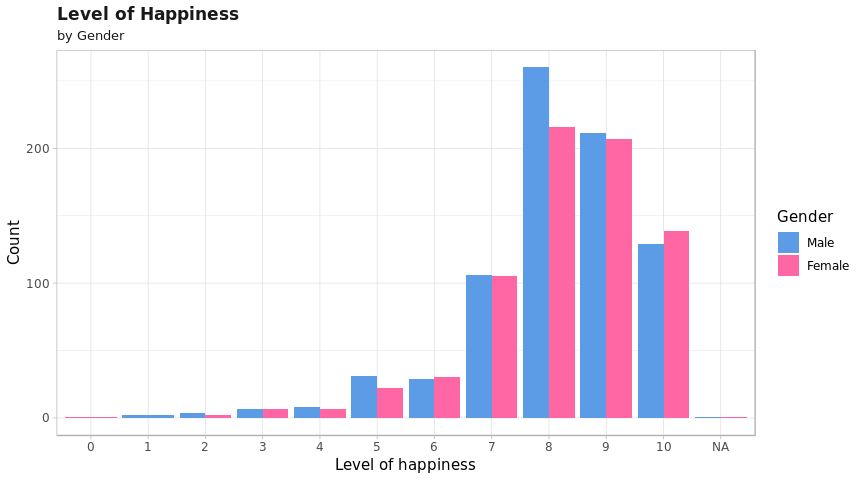
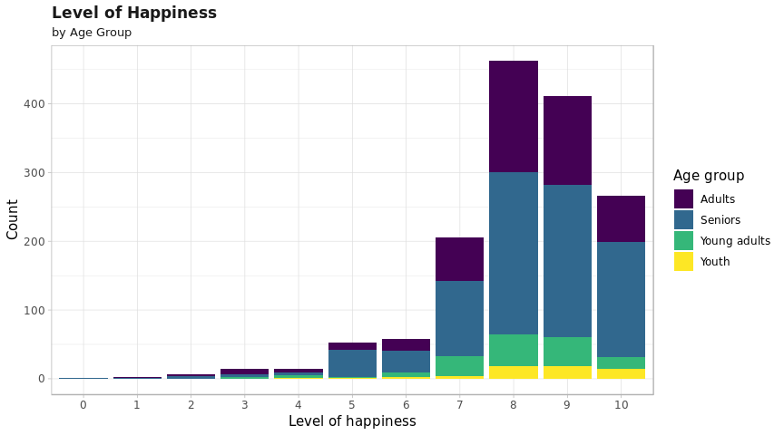
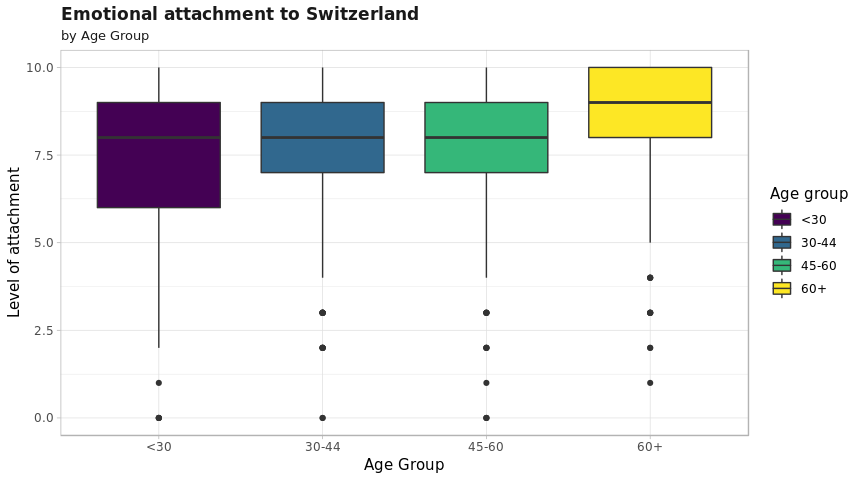

# Data Analysis is Sociology
This repository contains materials from the Data Analysis in Sociology course at HSE. 

### Outline:
- First year: 
- Second year:
- Third year:

## Projects
### First year 
**[Project](final-second_course/final_DA.md)**  
**Data**: European Social Survey  
**Topic**: Switzerland: subjective well-being, social exclusion, religion, national and ethnic identity   
**Goal**: examine factors that may influence the level of happiness and well-being of Switzerland's citizens  
**Methods applied**:
- t-test
- chi-square  
- ANOVA  
- linear regression

**Main findings**:
- People in Switzerland seem to be quite happy *(from 7 to 10)* regardless of their age and gender  
  
  

- Feeling of safety affects the level of happiness  
- Older citizens feel more emotionally attached to the country than the young ones  
  
- Those who are attached to country seem to be happier  

**Responsibilities**: data visualization, analysis, final report, team lead *(making sure everything is under control and teammates are not suffering)*

### Third & fourth years
Do not exist yet :)
