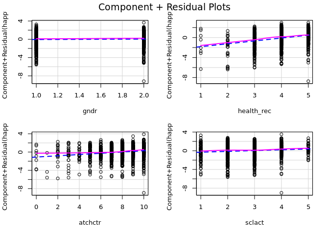
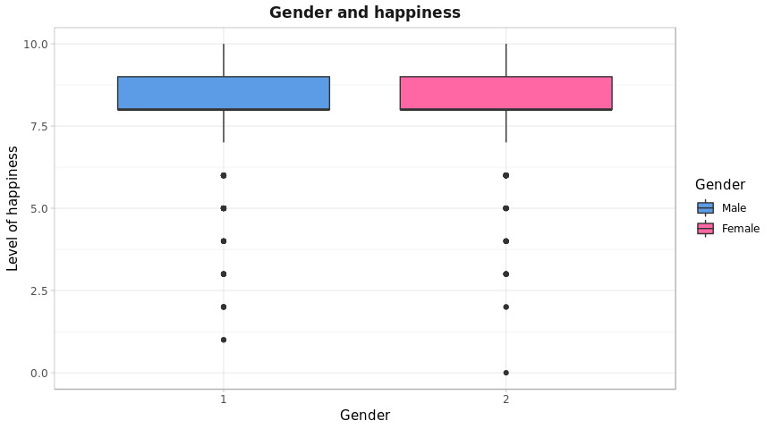
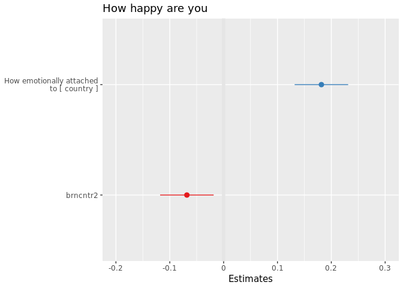

# Introduction
For our *Data Analysis in Sociology* project, our team decided to choose **Switzerland** for country and **subjective well-being, social exclusion, religion, national and ethnic identity** as a topic. Here we are going to look at different factors that may influence the level of happiness and well-being of this country's citizens :)

Firstly, we look at the *level of happiness* and see if it differs between *males and females* and between *age groups*, then at how people estimate their *level of participation in social activities compared to others of the same age*. In order to understand whether there is a connection between *feeling of safety* and respondent's or a member of the household's *being a victim of a burglary or assault* in the *last 5 years*, we do a *chi-square* test. After that, we move to the level of *emotional attachment to the country* and apply *t-test* in order to find out whether level of emotional attachment to Switzerland differ between males and females aged 25-45. Finally, we take the same variable and do *ANOVA* to find out whether the attachment differs *between people of different age groups*. 

In the end we create **regression models** and investigate happiness in Switzerland.

So, let's start.


***
# Preparation 
Our first step is downloading the packages and selecting the variables that we are going to use in further work. 


```r
library(ggplot2)
library(dplyr)
library(psych)
library(knitr)
library(RCurl)
library(car)
library(gridExtra)
library(ggpubr)
library(QuantPsyc)
library(haven)
library(plyr)
library(sjPlot)
library(lmtest)
library(tidyverse)
library(viridis)

# eval(parse(text = getURL("https://raw.githubusercontent.com/MaksimRudnev/LittleHelpers/master/download_ess/download_ess.R")))
# Suisse <- download_ess(round = 8, country="CH", "actuallyykatie@gmail.com") 
Suisse <- read_sav("ESS8CH.sav") #here we downloaded the data
Suisse <- Suisse %>% dplyr::select(happy, agea, atchctr, crmvct, aesfdrk, gndr, sclact)
```

## Description
And here is some descriptive statistics for our data.


```r
describe(Suisse)
```

```
##         vars    n  mean    sd median trimmed   mad min max range  skew
## happy      1 1523  8.18  1.48      8    8.36  1.48   0  10    10 -1.34
## agea       2 1519 47.83 18.78     48   47.57 22.24  15  94    79  0.08
## atchctr    3 1522  7.88  1.90      8    8.14  1.48   0  10    10 -1.26
## crmvct     4 1524  1.81  0.39      2    1.89  0.00   1   2     1 -1.58
## aesfdrk    5 1523  1.67  0.69      2    1.58  1.48   1   4     3  0.76
## gndr       6 1525  1.48  0.50      1    1.48  0.00   1   2     1  0.07
## sclact     7 1503  2.77  0.87      3    2.76  1.48   1   5     4  0.08
##         kurtosis   se
## happy       2.97 0.04
## agea       -0.95 0.48
## atchctr     2.04 0.05
## crmvct      0.49 0.01
## aesfdrk     0.24 0.02
## gndr       -2.00 0.01
## sclact     -0.09 0.02
```


# Plots of variables

## Level of happiness
### by gender
Value | Meaning 
--------|--------
0 | Extremely unhappy
10 | Extremely happy


According to the following graph, level of happiness **does not significantly differ** between males and females. However, more men estimated their level of happiness as "8", while more women answered "extremely happy". Also, the mode is 8 for both groups of individuals. 


```r
ggplot()+
  geom_bar(data = Suisse, aes(x = factor(happy), fill = factor(gndr)), position = "dodge")+
  theme_light()+
  ylab("Count")+
  xlab("Level of happiness")+
  ggtitle('Level of Happiness', subtitle = 'by Gender') +
  scale_fill_manual("Gender", values = c("#5c9ce6", "#FF67A4"), 
                    labels = c("Male", "Female"))+
  theme(plot.title = element_text(family = "Helvetica", face="bold", color = "#191919", 
                                  size = 13), 
        plot.subtitle = element_text(family = "Helvetica", color = "#191919", 
                                     size = 10))
```

<!-- -->

***

### by age group {.tabset .tabset-pills .tabset-fade}

In order to build another graph, we decided to split the variable "agea" into 4 groups: people under 18, from 18 to 24, 25 to 45, and over 45, and then save it into the new variable "AgeGroup".


```r
Suisse$AgeGroup <- ifelse(Suisse$agea > 45,"Seniors", ifelse(Suisse$agea <= 45 & Suisse$agea >= 25,"Adults", ifelse(Suisse$agea < 25 & Suisse$agea >= 18,"Young adults","Youth")))
```

**Most** of the individuals estimated their level of happiness **from 7 to 10**. The most frequent value (mode) equals 8.  
As for each age group, no significant correlation can be seen: individuals of **each age group** are pretty much **equally satisfied**. However, people **over 45** reported **more answers "5"** than representatives of other groups, perhaps due to illnesses and their general level of health.

#### Plot


```r
ggplot()+
  geom_bar(data = na.omit(Suisse), aes(x = factor(happy), fill = AgeGroup))+
  theme_light()+
  ylab("Count")+
  xlab("Level of happiness")+
  ggtitle('Level of Happiness', subtitle = 'by Age Group') +
  theme(plot.title = element_text(family = "Helvetica", face="bold", color = "#191919", 
                                  size = 13), 
        plot.subtitle = element_text(family = "Helvetica", color = "#191919", 
                                     size = 10)) +
  scale_fill_viridis("Age group", option='viridis', discrete=TRUE)
```

<!-- -->

#### Age Group distribution

```r
Suisse2 <- Suisse %>% dplyr::select(AgeGroup)
ggplot()+ geom_bar(data = na.omit(Suisse2), aes(x=AgeGroup, fill = AgeGroup))+
  theme_light()+
  ylab("Count")+
  xlab("Age groups")+
  ggtitle("Number of people", subtitle = "for each age group")+
  scale_x_discrete(limits = c("Youth", "Young adults", "Adults","Seniors"))+
  theme(plot.title = element_text(family = "Helvetica", face="bold", color = "#191919", 
                                  size = 13), 
        plot.subtitle = element_text(family = "Helvetica", color = "#191919", 
                                     size = 10)) +
  scale_fill_viridis("Age group", option='viridis', discrete=TRUE)
```

<!-- -->

***

## Taking part in social activities
Next, we look at how people estimate their **frequency of social activities participation compared to other people of the same age**.  

Values |	Categories
-------|--------
1	|Much less than most	
2	|Less than most	
3	|About the same	
4	|More than most	
5	|Much more than most	
7	|Refusal
8	|Don't know
9	|No answer

According to the bar chart, **most** of the individuals estimated their frequency of social activities participation compared to the people of the same age as **"above the same"** or as **"less than most"**. A small number of people thought that they participate much more than most of the representatives of their age.


```r
ggplot() + geom_bar(data = Suisse, aes(x = factor(sclact)), fill="#FF0033") +
  xlab("how often")+
  ggtitle("Frequency of social activities participation", subtitle="compared with people of the same age")+
  theme_light()+
  theme(plot.title = element_text(family = "Helvetica",  color = "#191919", 
                                  size = 13), 
        plot.subtitle = element_text(family = "Helvetica", color = "#191919", 
                                     size = 10)) 
```

<!-- -->

***

# **Chi-square**: feeling of safety & being a victim 

In order to understand whether there is a connection between **feeling of safety** and respondent's or a member of the household's **being a victim of a burglary or assault** in the **last 5 years**, we decided to do a **chi-square** test and then visualize **Pearson's residuals**.  

**RQ**: Is there a difference in feeling of safety between those who have been victim of a burglary or assault in the last 5 years and those who have not?

Feeling of safety | Been a victim
--------|--------
4	Very unsafe |	1	Yes	
3	Unsafe |	2	No
2	Safe  |	
1	Very safe| 

***

### Hypotheses
$H_0$: there is *no difference* (no correlation between feeling of safety and being a victim in the past 5 years)  
$H_1$: there is a *difference* in feeling of safety between those who have been a victim and those who have not

***

### Requirements
At first, we made sure that there at least 5 cases in each cell.  

```r
table(Suisse$crmvct, Suisse$aesfdrk)
```

```
##    
##       1   2   3   4
##   1 105 142  37   6
##   2 570 544 105  13
```

***

### Results 
As for chi-square, the **p-value** was **0.0046**, less than 0.05, which means that we can **reject the null hypothesis** and say that **there is a difference** in the feeling of safety between those who have been a victim and those who have not (*based on our data*).  


```r
ch1 <- chisq.test(Suisse$crmvct, Suisse$aesfdrk)
ch1
```

```
## 
## 	Pearson's Chi-squared test
## 
## data:  Suisse$crmvct and Suisse$aesfdrk
## X-squared = 13.008, df = 3, p-value = 0.00462
```
  
  
Then we visualized it and made some conclusions.  

* **People who have been a victim** (group 1), reported a **significantly higher** number of answers **"unsafe"** and **"very unsafe"** than expected. The possible explanation is that such individuals do not feel safe due to their past experience.  
* The number of **"victims"** who feel **"very safe"** is **significantly lower** than expected.  
* **People who have not been a victim** (group 2) reported a **significantly higher** number of answers **"Very safe"** compared to the expected number. In other words, such people feel even safer than expected.

#### Pearson residuals


```r
ch1.resid = as.data.frame(ch1$residuals)
ch1.count = as.data.frame(ch1$observed)

ggplot() + 
  geom_raster(data = ch1.resid, aes(x = Suisse.crmvct, y = Suisse.aesfdrk, fill = Freq), hjust = 0.5, vjust = 0.5) + 
  scale_fill_gradient2("Pearson residuals", low = "#2166ac", mid = "#f7f7f7", high = "#b2182b", midpoint = 0) +
  geom_text(data = ch1.count, aes(x = Suisse.crmvct, y = Suisse.aesfdrk, label = Freq)) +
  xlab("Been a crime victim") +
  ylab("Feeling of safety")+
  scale_x_discrete(labels = c("Yes", "No"))+
  scale_y_discrete(labels = c("Very safe", "Safe ","Unsafe","Very unsafe"))
```

<!-- -->

***

# **t-test**: level of emotional attachment to Switzerland by gender
At first, let's create a subset of our data and filter it by age group as we are interested in adults (25-45), and then formulate RQ & hypotheses.


```r
Suisse1 <- Suisse %>% dplyr::select(AgeGroup, atchctr, gndr) %>% filter(AgeGroup == "Adults") #subset for t-test
```

**RQ:** Does level of emotional attachment to Switzerland differ between males and females aged 25-45 (adults)?  

### Hypotheses
$H_0$: there is *no difference* in the level of emotional attachment to Switzerland between males and females  
$H_1$: there is *a difference* in the level of emotional attachment to Switzerland between males and females  

***

### Type of distribution {.tabset .tabset-pills .tabset-fade}

Here we need to check if our data is normally distributed.  

* According to the **Shapiro-Wilk test**, the **p-value** is **< 2.2e-16**, which means that our distribution is **not normal**.  
* From the **histogram** and **density plot** we also concluded that the variable "atchctr" is **not distributed normally** as it has quite a long left tail *(log does not help)*.  

#### Shapiro-Wilk test

```r
shapiro.test(Suisse1$atchctr) #p-value below 0.01
```

```
## 
## 	Shapiro-Wilk normality test
## 
## data:  Suisse1$atchctr
## W = 0.88502, p-value < 2.2e-16
```

***

#### Histogram

```r
hist(Suisse1$atchctr, xlab = "Level of emotional attachment to Switzerland", 
     main = "Distribution of the level\nof attachment to Switzerland")
```

<!-- -->

***

#### Density plot

```r
ggdensity(as.numeric(Suisse1$atchctr),
          title = "Density plot of the level of attachment to Switzerland", 
          xlab = "Level of emotional attachment to Switzerland", 
          ylab = "Density", fill="#FF0033", alpha = 0.3)+
  theme_light()+
  theme(plot.title = element_text(family = "Helvetica", face="bold", color = "#191919", 
                                  size = 13)) 
```

<!-- -->

***

### Variances  {.tabset .tabset-pills .tabset-fade}
... And then we have to **check the variances**.
Our distribution is not normal, so we used **Levene's test** and **Fligner-Killeen test** as they are considered as a better option in such situations *(less sensitive to non-normally distributed data)*.  
~~(and Bartlett test just in case)~~  

#### Levene's test
$H_0$: group variances are equal  
$H_1$: group variances are unequal  

According to this test, we have a high p-value (> 0.05), which means that we cannot reject the $H_0$, and **variances** in our data **are equal**.


```r
leveneTest(Suisse1$atchctr ~ factor(Suisse1$gndr))
```

```
## Levene's Test for Homogeneity of Variance (center = median)
##        Df F value Pr(>F)
## group   1  0.1356 0.7129
##       468
```
***
#### Fligner-Killeen test 
This test is considered as a better option for non-normally distributed data, so we decided to do that as well.  
$H_0$: group variances are equal  
$H_1$: group variances are unequal  

Since the **p-value** is **0.5607** > 0.05, we **cannot reject** the null hypothesis that the group variances are **equal**. 


```r
fligner.test(Suisse1$atchctr~ Suisse1$gndr)
```

```
## 
## 	Fligner-Killeen test of homogeneity of variances
## 
## data:  Suisse1$atchctr by Suisse1$gndr
## Fligner-Killeen:med chi-squared = 0.33851, df = 1, p-value =
## 0.5607
```
***

#### Bartlett test  
Here the **p-value** is **0.8248** > .05, therefore, the **variances are equal**.

```r
bartlett.test(Suisse1$atchctr~ Suisse1$gndr)
```

```
## 
## 	Bartlett test of homogeneity of variances
## 
## data:  Suisse1$atchctr by Suisse1$gndr
## Bartlett's K-squared = 0.049027, df = 1, p-value = 0.8248
```


***

### t-test results 
As we can see, the **p-value** in our case is  **0.9018** > 0.05, which means that we **cannot reject the null hypothesis** based on our data, and there is **no significant difference** as 0 is included into the confidence interval.  
In other words, men and women aged from 25 to 45 (adults) are **attached** to Switzerland to the **similar extent**.


```r
t.test(Suisse1$atchctr ~ Suisse1$gndr, var.equal = TRUE)
```

```
## 
## 	Two Sample t-test
## 
## data:  Suisse1$atchctr by Suisse1$gndr
## t = -0.12344, df = 468, p-value = 0.9018
## alternative hypothesis: true difference in means is not equal to 0
## 95 percent confidence interval:
##  -0.3859801  0.3403551
## sample estimates:
## mean in group 1 mean in group 2 
##        7.518672        7.541485
```

We also decided to run the **Wilcox test** which showed the same result: $H_0$ **cannot be rejected**.  

```r
wilcox.test(Suisse1$atchctr ~ Suisse1$gndr) 
```

```
## 
## 	Wilcoxon rank sum test with continuity correction
## 
## data:  Suisse1$atchctr by Suisse1$gndr
## W = 27638, p-value = 0.976
## alternative hypothesis: true location shift is not equal to 0
```


In order to visualize this a **boxplot** was created.  
The level of emotional attachment *does not differ* between adult males and females: the median for both is located somewhere at 8. It also can be noted that variances are the same.


```r
ggplot() +
  geom_boxplot(data = na.omit(Suisse1), aes(x = factor(gndr), y = as.numeric(atchctr), fill = factor(gndr))) +
  xlab("Gender") +
  ylab("Level of attachment") +
  ggtitle("Adults's emotional attachment to Switzerland", subtitle = 'by Gender') +
  theme_light()+
  scale_fill_manual("Gender", values = c("#5c9ce6", "#ff3366"), labels = c("Male", "Female"))+
  scale_x_discrete(labels = c("Male", "Female"))+
  theme(plot.title = element_text(family = "Helvetica", face="bold", color = "#191919", 
                                  size = 13), 
        plot.subtitle = element_text(family = "Helvetica", color = "#191919", 
                                     size = 10))
```

<!-- -->


***

# **ANOVA** 
In this part of our project we are going to use ANOVA test to find out whether the **level of emotional attachment** to Switzerland differs between **people of different age groups**.  

### Preparation {.tabset .tabset-pills .tabset-fade}


#### Variables and RQ

After a small discussion, we decided to choose **level of emotional attachment to Switzerland** and **age group** for our ANOVA test in order to find out whether the attachment differs between people of different age.  

**RQ:** Does the level of emotional attachment differ between people from different age groups?  

**Hypotheses:**  
$H_0$: there is *no difference* in the level of emotional attachment to Switzerland between people of different age groups   
$H_1$: there is *a difference* in the level of emotional attachment to Switzerland between people of different age groups   

#### Data

Here we download and select the data, and then create a new variable - *AgeGroup*. The criteria for the division will be provided later in section *"Normality of the distribution"*, where we built histograms, etc.


```r
SuisseANOVA <- Suisse %>% dplyr::select(agea, atchctr)
SuisseANOVA$AgeGroup <- ifelse(SuisseANOVA$agea > 60,"60+", 
                          ifelse(SuisseANOVA$agea <= 60 & SuisseANOVA$agea >= 45,"45-60", 
                                 ifelse(SuisseANOVA$agea < 45 & SuisseANOVA$agea >= 30,"30-44",
                                        "<30"))) #new variable
SuisseANOVA$AgeGroup <- as.factor(SuisseANOVA$AgeGroup)
```

***

#### Descriptive statistics by age group
In this section the descriptive statistics by group is provided.


```r
psych::describeBy(SuisseANOVA, SuisseANOVA$AgeGroup)
```

```
## 
##  Descriptive statistics by group 
## group: <30
##           vars   n  mean   sd median trimmed  mad min max range  skew
## agea         1 323 22.18 4.14     22   22.20 4.45  15  29    14 -0.02
## atchctr      2 321  7.20 2.10      8    7.41 1.48   0  10    10 -0.97
## AgeGroup*    3 323  1.00 0.00      1    1.00 0.00   1   1     0   NaN
##           kurtosis   se
## agea         -1.16 0.23
## atchctr       0.99 0.12
## AgeGroup*      NaN 0.00
## -------------------------------------------------------- 
## group: 30-44
##           vars   n  mean   sd median trimmed  mad min max range  skew
## agea         1 340 37.20 4.44     37   37.22 5.93  30  44    14  0.01
## atchctr      2 340  7.64 1.91      8    7.86 1.48   0  10    10 -1.17
## AgeGroup*    3 340  2.00 0.00      2    2.00 0.00   2   2     0   NaN
##           kurtosis   se
## agea         -1.36 0.24
## atchctr       1.66 0.10
## AgeGroup*      NaN 0.00
## -------------------------------------------------------- 
## group: 45-60
##           vars   n  mean   sd median trimmed  mad min max range  skew
## agea         1 437 52.56 4.62     52   52.56 5.93  45  60    15  0.02
## atchctr      2 437  8.08 1.76      8    8.33 1.48   0  10    10 -1.58
## AgeGroup*    3 437  3.00 0.00      3    3.00 0.00   3   3     0   NaN
##           kurtosis   se
## agea         -1.27 0.22
## atchctr       3.79 0.08
## AgeGroup*      NaN 0.00
## -------------------------------------------------------- 
## group: 60+
##           vars   n  mean   sd median trimmed  mad min max range  skew
## agea         1 419 71.31 7.32     70   70.72 7.41  61  94    33  0.70
## atchctr      2 418  8.40 1.66      9    8.65 1.48   1  10     9 -1.29
## AgeGroup*    3 419  4.00 0.00      4    4.00 0.00   4   4     0   NaN
##           kurtosis   se
## agea         -0.11 0.36
## atchctr       1.96 0.08
## AgeGroup*      NaN 0.00
```


In addition, here is a visualization of our data: **mean plots** for each group.  
As we can notice, the mean value for the level of emotional attachment to country increases with age.


```r
ggline(na.omit(SuisseANOVA), x = "AgeGroup", y = "atchctr", 
       add = c("mean_se", "jitter"),
       ylab = "Level", xlab = "Group")
```

<!-- -->


***


### Assumptions test

In general, ANOVA has three assumptions:

* independence of observations  
* normal distribution of the data of each factor level  
* common variance  


### Normality of the distribution

#### Distribution & outliers
First, let's look at the distribution of age *("agea")*: 


```r
#hist(SuisseANOVA$agea, xlab = "Age", main = "Distribution of Age")
SuisseANOVA %>% 
  ggplot()+geom_histogram(aes(x= agea), fill="#DD5E89", alpha = 0.9) +
  xlab("Age")+
  ggtitle("Distribution of age")+
  theme_light()+ theme(plot.title = element_text(family = "Helvetica", face = "bold", color = "#191919", size = 13, hjust = 0.5))
```

<!-- -->

Based on the histogram, we decided to **divide** this variable into **4 age groups**: people under 30, from 30 to 44, from 45 to 60, and 60+.  
We had a bit different age groups in previous works, but the distribution of people between them was not very equal and balanced, so we decided to fix that.  


```r
SuisseANOVA1 <- SuisseANOVA %>% dplyr::select(AgeGroup)
ggplot()+ 
  geom_bar(data = na.omit(SuisseANOVA1), aes(x=AgeGroup, fill = AgeGroup))+
  theme_light()+
  ylab("Count")+
  xlab("Age groups")+
  ggtitle("Number of people for each age group")+
  theme(plot.title = element_text(family = "Helvetica", face="bold", color = "#191919", size = 13), 
        plot.subtitle = element_text(family = "Helvetica", color = "#191919", size = 10)) +
  scale_x_discrete(limits = c("<30", "30-44","45-60","60+"))+
  scale_fill_viridis("Age group", option='viridis', discrete=TRUE)
```

<!-- -->

And now boxplot:


```r
ggplot() +
  geom_boxplot(data = na.omit(SuisseANOVA), aes(x = AgeGroup, y = as.numeric(atchctr), fill = AgeGroup)) +
   xlab("Age Group") +
  ylab("Level of attachment") +
  ggtitle("Emotional attachment to Switzerland", subtitle = "by Age Group") +
  theme_light()+
  theme(plot.title = element_text(family = "Helvetica", face="bold", color = "#191919", size = 13), plot.subtitle = element_text(family = "Helvetica", color = "#191919", size = 10)) +
  scale_x_discrete(limits = c("<30", "30-44","45-60","60+"))+
  scale_fill_viridis("Age group", option='viridis', discrete=TRUE)
```

<!-- -->

As we can see, there are **outliers** that can violate our ANOVA test. In total, we have **35** of them. After estimating pros and cons, we concluded that it's better not to remove data and **keep them**.  
(In other words: no particular reasons why these observations should be removed)


```r
car::Boxplot(as.numeric(SuisseANOVA$atchctr)~SuisseANOVA$AgeGroup, method = "y", 
             xlab = "Age Group", 
             ylab = "Level of emotional attachment")
```

<!-- -->

```
##  [1] "233"  "1012" "1077" "1437" "1498" "801"  "1509" "60"   "164"  "731" 
## [11] "967"  "1131" "1214" "188"  "442"  "819"  "1433" "1463" "544"  "5"   
## [21] "790"  "1488" "1506" "85"   "811"  "345"  "494"  "619"  "311"  "354" 
## [31] "745"  "771"  "947"  "214"  "224"
```


***

#### Test for normality for each age group

Then have to check the normality of distribution *for each group* using **Shapiro-Wilk test**.

$H_0$: distribution is **normal**  
$H_1$: distribution is **not normal**  

* The *p-value* for each group is *< 0.05*, so we can conclude that distribution is **not normal for every group**.  


```r
shapiro.test(SuisseANOVA$atchctr[SuisseANOVA$AgeGroup == "<30"])  # p-value = 1.637e-12
```

```
## 
## 	Shapiro-Wilk normality test
## 
## data:  SuisseANOVA$atchctr[SuisseANOVA$AgeGroup == "<30"]
## W = 0.91489, p-value = 1.637e-12
```

```r
shapiro.test(SuisseANOVA$atchctr[SuisseANOVA$AgeGroup == "30-44"])  # p-value = 5.657e-15
```

```
## 
## 	Shapiro-Wilk normality test
## 
## data:  SuisseANOVA$atchctr[SuisseANOVA$AgeGroup == "30-44"]
## W = 0.88942, p-value = 5.657e-15
```

```r
shapiro.test(SuisseANOVA$atchctr[SuisseANOVA$AgeGroup == "45-60"])  # p-value < 2.2e-16
```

```
## 
## 	Shapiro-Wilk normality test
## 
## data:  SuisseANOVA$atchctr[SuisseANOVA$AgeGroup == "45-60"]
## W = 0.84299, p-value < 2.2e-16
```

```r
shapiro.test(SuisseANOVA$atchctr[SuisseANOVA$AgeGroup == "60+"])  # p-value < 2.2e-16
```

```
## 
## 	Shapiro-Wilk normality test
## 
## data:  SuisseANOVA$atchctr[SuisseANOVA$AgeGroup == "60+"]
## W = 0.84379, p-value < 2.2e-16
```

The following bar charts also show that distribution for each group is not normal.

<!-- -->


***

###  Normality of the residuals

As we have *1525 observations* in total, which is less than 5000, we need to *check the normality of residuals* via Shapiro-Wilk test.

$H_0$: distribution is **normal**  
$H_1$: distribution is **not normal**  

* According to the **Shapiro-Wilk test**, the **p-value** is *2.2e-16 < 0.05*, which means that we can reject the $H_0$ and say that our distribution is **not normal**.


```r
model <- aov(SuisseANOVA$atchctr ~ SuisseANOVA$AgeGroup) 
res <- model$residuals 
shapiro.test(res)
```

```
## 
## 	Shapiro-Wilk normality test
## 
## data:  res
## W = 0.91385, p-value < 2.2e-16
```

***


### Levene's Test

The next step is to *check the variances* using Levene's Test:

$H_0$: group variances are *equal*  
$H_1$: group variances are *unequal*  

* According to this test, **p-value** is **less than 0.05** which means that we can reject the $H_0$, and variances in our data are **unequal**.


```r
leveneTest(SuisseANOVA$atchctr ~ SuisseANOVA$AgeGroup)
```

```
## Levene's Test for Homogeneity of Variance (center = median)
##         Df F value   Pr(>F)   
## group    3  5.0682 0.001706 **
##       1512                    
## ---
## Signif. codes:  0 '***' 0.001 '**' 0.01 '*' 0.05 '.' 0.1 ' ' 1
```

***

### ANOVA

Now we run *ANOVA one way test* taking our unequal variances into consideration.

$H_0$: there is **no difference** in means between groups  
$H_1$: there is **a difference** in means between at least two groups  

We can see that the received F-ratio is **significant**: F(3, 799.12) = 27.821, p-value < 2.2e-16 ( less than 0.05).  
According to that, we conclude that people from at least one pair of groups **have different level of attachment** to Switzerland.


```r
oneway.test(SuisseANOVA$atchctr ~ SuisseANOVA$AgeGroup, var.equal = FALSE)
```

```
## 
## 	One-way analysis of means (not assuming equal variances)
## 
## data:  SuisseANOVA$atchctr and SuisseANOVA$AgeGroup
## F = 27.821, num df = 3.00, denom df = 799.12, p-value < 2.2e-16
```

***

### Kruskal-Wallis test
Previously we found out that we have some outliers that can affect the results of ANOVA.  
One possible solution is to use a non-parametric **Kruskal-Wallis test**.  

$H_0$: there is **no difference** between groups  
$H_1$: there is **a difference** between at least two groups  

P-value is significant *(< 2.2e-16)* and less than 0.05, so we conclude that the differences between groups are significant. This conclusion confirms the result of ANOVA.


```r
kruskal.test(as.numeric(SuisseANOVA$atchctr) ~ SuisseANOVA$AgeGroup)
```

```
## 
## 	Kruskal-Wallis rank sum test
## 
## data:  as.numeric(SuisseANOVA$atchctr) by SuisseANOVA$AgeGroup
## Kruskal-Wallis chi-squared = 91.467, df = 3, p-value < 2.2e-16
```


***

### Pairwise Comparisons

Since the ANOVA test is significant, we should check **what levels are different from each other** by running *pairwise.t.test()* function.  
Here we can notice that **all** groups are **significantly different** from each other, especially pair "<30" and "60+".  
In general, we can conclude that people from the oldest age group ("60+") are more attached to the country than the younger ones.


```r
pairwise.t.test(SuisseANOVA$atchctr, SuisseANOVA$AgeGroup, adjust="bonferroni") 
```

```
## 
## 	Pairwise comparisons using t tests with pooled SD 
## 
## data:  SuisseANOVA$atchctr and SuisseANOVA$AgeGroup 
## 
##       <30     30-44   45-60 
## 30-44 0.0045  -       -     
## 45-60 4.5e-10 0.0025  -     
## 60+   < 2e-16 6.8e-08 0.0120
## 
## P value adjustment method: holm
```


***
# Mid-Conclusions
1. **Most** of the individuals estimated their level of happiness **from 7 to 10**  
2. People in Switzerland seem to be **quite happy regardless of their age and gender** ~~(or just suffer equally)~~  
3. Most of the individuals estimated their **frequency of social activities participation** as **“above the same”** or as **“less than most”**  
4. People who have **been a victim** feel **unsafe** or **very unsafe** **more often** than those who have not
5. People who have **not been a victim** feel even **safer than expected**  
6. Level of **emotional attachment** does **not differ** between adult **males** and **females**
7. **Older citizens** are **more attached to the country**, while **young adults** seem to be **the least attached** to Switzerland  
8. The most significant difference is between groups "<30" and "60+"  

In general, we can conclude that people in Switzerland seem to be quite happy regardless of their age and gender ~~(or just suffer equally)~~. We also found out that victims feel very unsafe, while those who have not been a victim tend to estimate their feeling of safety as "very safe". Moreover, older citizens feel more emotionally attached to the country than the young ones.


# Regression 

## Research question and hypotheses

Previously we worked a lot with level of emotional attachment to Switzerland. This time we decided to focus on another variable - happy, which shows the general level of happiness.  
A lot of research has been done in order to identify the factors influencing happiness and why some people feel happier than others. According to World Happiness Report, the level of happiness in Switzerland seems to be one of the highest *(4th place)*. That is why we find it interesting to try to see what factors may affect the level of happiness of the Swiss, and make some conclusions based on ESS data.  
Using these four variables, we can then attempt to construct a linear regression model.

And perhaps understand why some people are happier than other.

After a little research, we decided to take such predictors as subjective general health *(health)*, social activity compared to people of the same age *(sclact)*, attachment to country *(atchctr)*, and also gender *(gndr)*. 

**RQ:** What of the selected factors do affect the level of happiness of Switzerland citizens?

**Hypotheses:**  

$H_1$: Health has a positive effect on the level of happiness  
$H_2$: Strong emotional attachment to country has a positive effect on happiness  
$H_3$: People who are highly socially active are happier   
 


***

Our first step is downloading the packages and selecting the variables that we are going to use in further work.    

*P.S. As variable 'health' is coded as 1 - very good and 5 - very bad, it's better to recode that in the opposite order for the sake of easier interpretation.*


```r
# eval(parse(text = getURL("https://raw.githubusercontent.com/MaksimRudnev/LittleHelpers/master/download_ess/download_ess.R")))
# S <- download_ess(round = 8, country="CH", "actuallyykatie@gmail.com") 
Suisse <- read_sav("ESS8CH.sav") #here we downloaded the data
Suisse <- Suisse %>% dplyr::select(happy, agea, atchctr, health, gndr, sclact)
Suisse$health_rec <- mapvalues(Suisse$health, from = c(1:5), to = c(5:1)) # recoded
fit <- lm(happy ~ gndr + health_rec + atchctr + sclact, data = Suisse) # to use before the final part
```


## Description and assumptions

In the following section we are going to provide some descriptive statistics and check the assumtions for our final model.

 
* normally distributed residuals of the outcome/ normality of distribution    
* linearity 
* predictors have an unlimited range  
* independent observations (no correlation between their residuals)  
* independent variables (no multicollinearity)  
* no outliers  
* homoscedasticity (residual variances are the same along the values of Y)  


***

### Normality {.tabset .tabset-fade .tabset-pills}

Here is the check of distribution for each variable used in our models and briefly describe them. 
According to the plot, distribution of residuals is not normal *(but close)*, and there might be some outliers.


```r
qqPlot(fit, main="QQ Plot") #qq plot for studentized resid 
```

<!-- -->

```
## [1] 178 869
```

**Now variables:**

#### happy

First, let's look at our main variable - **happy**.

**Q:** Taking all things together, how happy would you say you are?

Values |	Categories
-------|--------
0 | Extremely unhappy
10 | Extremely happy


The p-value is < 0.05, so the distribution is not normal.

```r
shapiro.test(Suisse$happy) 
```

```
## 
## 	Shapiro-Wilk normality test
## 
## data:  Suisse$happy
## W = 0.86737, p-value < 2.2e-16
```

The majority of resondents estimated their level of happiness from **8 to 10**. In our previous projects we also found that people in Switzerland seem to be **quite happy regardless of their age and gender**.


```r
Suisse %>% filter(!is.na(happy)) %>% 
  ggplot()+geom_bar(aes(x= as.factor(happy)), fill="#ff5e62") +
  xlab("Level of happiness")+
  ggtitle("Distribution of the level of happiness in Switzerland")+
  theme_light()+ theme(plot.title = element_text(family = "Helvetica", face = "bold", color = "#191919", size = 13, hjust = 0.5))
```

<!-- -->

***

#### sclact

Next, at how people estimate their **frequency of social activities participation compared to other people of the same age**.  

Values |	Categories
-------|--------
1	|Much less than most	
2	|Less than most	
3	|About the same	
4	|More than most	
5	|Much more than most	
7	|Refusal
8	|Don't know
9	|No answer

According to the bar chart, **most** of the individuals estimated their frequency of social activities participation compared to the people of the same age as **"above the same"** or as **"less than most"**. A small number of people thought that they participate much more than most of the representatives of their age.


```r
Suisse %>% filter(!is.na(sclact)) %>% 
  ggplot() + geom_bar(aes(x = factor(sclact)), fill="#6864B8") +
  xlab("how often")+
  ggtitle("Frequency of social activities participation", subtitle = "compared with people of the same age")+ theme_light()+ 
  theme(plot.title = element_text(family = "Helvetica", face = "bold", 
                                  color = "#191919", size = 13, hjust = 0.5), 
        plot.subtitle = element_text(family = "Helvetica", color = "#191919", 
                                     size = 10, hjust = 0.5))
```

<!-- -->

$H_0$: distribution is **normal**  
$H_1$: distribution is **not normal**  

According to the test, the p-value is *less than 0.05*, so distribution is not normal


```r
shapiro.test(Suisse$sclact)
```

```
## 
## 	Shapiro-Wilk normality test
## 
## data:  Suisse$sclact
## W = 0.88706, p-value < 2.2e-16
```

***


#### atchctr

Q: How emotionally attached do you feel to Switzerland?

Values |	Categories
-------|--------
0 | Not at all emotionally attached	
10 | Very emotionally attached	

Our p-value is < 0.05, so the distribution is not normal.
 

```r
shapiro.test(Suisse$atchctr) 
```

```
## 
## 	Shapiro-Wilk normality test
## 
## data:  Suisse$atchctr
## W = 0.87391, p-value < 2.2e-16
```

Here we can see that most of the respondents are attached to the country at the level of 8-10.


```r
Suisse %>% filter(!is.na(atchctr)) %>% 
  ggplot()+geom_bar(aes(x= as.factor(atchctr)), fill="#DD5E89") +
  xlab("Level of emotional attachment to Switzerland")+
  ggtitle("Distribution of the level of attachment to Switzerland")+
  theme_light()+ theme(plot.title = element_text(family = "Helvetica", face = "bold", color = "#191919", size = 13, hjust = 0.5))
```

<!-- -->

***

#### health_rec

Q: How is your health in general?
**the variable is 'health' recoded in the opposite order**

Values | Categories
-------|----------
1	| Very bad
2 |	Bad	
3 |	Fair	
4 | Good
5	| Very good		
 

The p-value is < 0.05, so the distribution is not normal.

```r
shapiro.test(Suisse$health_rec) 
```

```
## 
## 	Shapiro-Wilk normality test
## 
## data:  Suisse$health_rec
## W = 0.80753, p-value < 2.2e-16
```

As we can see, most of the individuals estimate their health as good and very good.


```r
Suisse %>% filter(!is.na(health_rec)) %>% 
  ggplot()+geom_bar(aes(x = as.factor(health_rec)), fill="#5390DD") +
  xlab("Subjective level of health")+
  ggtitle("Distribution of the level of health")+
  theme_light()+ theme(plot.title = element_text(family = "Helvetica", face = "bold", color = "#191919", size = 13, hjust = 0.5))
```

<!-- -->

***

#### agea


```r
Suisse %>% filter(!is.na(agea)) %>% 
  ggplot()+geom_histogram(aes(x= agea), fill="#DD5E89", alpha = 0.9) +
  xlab("Age")+
  ggtitle("Distribution of age")+
  theme_light()+ theme(plot.title = element_text(family = "Helvetica", face = "bold", color = "#191919", size = 13, hjust = 0.5))
```

<!-- -->

***

#### gndr

As we can see, the number of males and females is almost the same.

```r
Suisse %>% filter(!is.na(gndr)) %>% 
  ggplot()+ geom_bar(aes(x= as.factor(gndr), fill = factor(Suisse$gndr))) +
  xlab("Gender")+
  ggtitle("Distribution of the gender")+
  theme_light()+ theme(plot.title = element_text(family = "Helvetica", face = "bold", color = "#191919", size = 13, hjust = 0.5))+
  scale_fill_manual("Gender", values = c("#5c9ce6", "#FF67A4"), labels = c("Male", "Female"))
```

<!-- -->

***


### Linearity {.tabset .tabset-fade .tabset-dropdown}

Our next step is to check the linearity.

In order to check if the predictors have a linear relationship to the dependent variable we decided to build component residual plots using *crPlots()*. Other separate plots are also provided.  

#### Component residual plot

Well, it seems like everything is more or less linear because the difference between the residual line and the component line is not so big.  


```r
crPlots(fit)
```

<!-- -->

#### gender

<!-- -->


#### health

<!-- -->

#### atchctr

<!-- -->


#### agea

<!-- -->


#### sclact

<!-- -->

***

### Outliers

Well, accordinf to the test and plots - there are some outliers, however, we won't delete them.

```r
# Assessing Outliers
outlierTest(fit) # Bonferonni p-value for most extreme obs
```

```
##      rstudent unadjusted p-value Bonferonni p
## 869 -6.828611         1.2434e-11   1.8651e-08
```

```r
leveragePlots(fit) # leverage plots
```

<!-- -->

***

### Heteroscedasticity

So, let's test if the variance of the residuals isn’t affected by the predicted value. 

P-value is less than 0.05, so we can reject the null hypothesis that the variance of the residuals is constant, and say that heteroscedasticity is present.


```r
ncvTest(fit) # NCV Test
```

```
## Non-constant Variance Score Test 
## Variance formula: ~ fitted.values 
## Chisquare = 105.842, Df = 1, p = < 2.22e-16
```

Some parts of the graph look good as the points are more or less distributed randomly, however, there seem to be some patterns which may indicate the violation of assumption of heteroscedasticity. 


```r
spreadLevelPlot(fit)
```

<!-- -->

```
## 
## Suggested power transformation:  3.453062
```

### Multicollinearity

Here we evaluate collinearity and come to the conclusion that there is no multicollinearity.
 

```r
vif(fit) # variance inflation factors 
```

```
##       gndr health_rec    atchctr     sclact 
##   1.000397   1.024139   1.010912   1.034807
```

### Autocorrelation (indep. of errors)

$H_0$ : no autocorrelation  
$H_1$ : there is an autocorrelation

No autocorrelation as p-value is 0.626


```r
durbinWatsonTest(fit)
```

```
##  lag Autocorrelation D-W Statistic p-value
##    1      0.01943244      1.960826   0.464
##  Alternative hypothesis: rho != 0
```

Same there :)

```r
bgtest(fit, order = 2)
```

```
## 
## 	Breusch-Godfrey test for serial correlation of order up to 2
## 
## data:  fit
## LM test = 1.9871, df = 2, p-value = 0.3703
```


## Models {.tabset .tabset-fade .tabset-pills}

Finally, we build simple models with each variable of our interest, including control variables such as age and gender.

### Model 1

So, the first model is for health and happiness. As we can see, health and age are significant predictors there as both p-values are lower than 0.05 and have *** significance score. Also, gender has no effect.     

The model overall explains 11% of variance, which is not so bad, and F-statistic: 67.12 on 3 and 1514 DF & p-value: < 2.2e-16 indicate that the model is significant and good.

Equation: $happy = 4.77 + 0.09*GenderFemale + 0.67*health + 0.011*age + Error$


```r
m1 <- lm(happy ~ as.factor(gndr) + health_rec + agea, data = Suisse)
summary(m1)
```

```
## 
## Call:
## lm(formula = happy ~ as.factor(gndr) + health_rec + agea, data = Suisse)
## 
## Residuals:
## <Labelled double>
##     Min      1Q  Median      3Q     Max 
## -8.8992 -0.6953  0.1530  0.9745  3.7814 
## 
## Labels:
##  value             label
##      0 Extremely unhappy
##      1                 1
##      2                 2
##      3                 3
##      4                 4
##      5                 5
##      6                 6
##      7                 7
##      8                 8
##      9                 9
##     10   Extremely happy
##     77           Refusal
##     88        Don't know
##     99         No answer
## 
## Coefficients:
##                  Estimate Std. Error t value Pr(>|t|)    
## (Intercept)      4.777686   0.249558  19.145  < 2e-16 ***
## as.factor(gndr)2 0.092336   0.071574   1.290    0.197    
## health_rec       0.675835   0.048331  13.984  < 2e-16 ***
## agea             0.011403   0.001982   5.754 1.05e-08 ***
## ---
## Signif. codes:  0 '***' 0.001 '**' 0.01 '*' 0.05 '.' 0.1 ' ' 1
## 
## Residual standard error: 1.393 on 1514 degrees of freedom
##   (7 observations deleted due to missingness)
## Multiple R-squared:  0.1174,	Adjusted R-squared:  0.1156 
## F-statistic: 67.12 on 3 and 1514 DF,  p-value: < 2.2e-16
```


### Model 2

The next model consists of gender, age and attachment to country. This model supports our conclusion about the connection between age and happiness (not signif. p-value), and shows that attachment to Switzerland does influence the level of happines as p-value is 4.42e-13.  

However, the adjusted R-squared is 0.03558, which is lower than for the previous model. Still, F-statistic and p-value *(1.765e-12 < 0.05)* indicate that the model is significant.


Equation: $happy = 6.94 + 0.087*GenderFemale + 0.0003*Age + 0.149*AttachmentToCountry + Error$


```r
m2 <- lm(happy ~ as.factor(gndr) + agea + atchctr , data = Suisse)
summary(m2)
```

```
## 
## Call:
## lm(formula = happy ~ as.factor(gndr) + agea + atchctr, data = Suisse)
## 
## Residuals:
## <Labelled double>
##     Min      1Q  Median      3Q     Max 
## -8.5447 -0.5419  0.0581  0.9007  2.9489 
## 
## Labels:
##  value             label
##      0 Extremely unhappy
##      1                 1
##      2                 2
##      3                 3
##      4                 4
##      5                 5
##      6                 6
##      7                 7
##      8                 8
##      9                 9
##     10   Extremely happy
##     77           Refusal
##     88        Don't know
##     99         No answer
## 
## Coefficients:
##                   Estimate Std. Error t value Pr(>|t|)    
## (Intercept)      6.9456038  0.1748108  39.732  < 2e-16 ***
## as.factor(gndr)2 0.0870044  0.0748652   1.162    0.245    
## agea             0.0003552  0.0020541   0.173    0.863    
## atchctr          0.1491866  0.0204180   7.307 4.42e-13 ***
## ---
## Signif. codes:  0 '***' 0.001 '**' 0.01 '*' 0.05 '.' 0.1 ' ' 1
## 
## Residual standard error: 1.455 on 1511 degrees of freedom
##   (10 observations deleted due to missingness)
## Multiple R-squared:  0.0375,	Adjusted R-squared:  0.03558 
## F-statistic: 19.62 on 3 and 1511 DF,  p-value: 1.765e-12
```

### Model 3

Here we use level of social activity. According to the results, gender again has no effect, while age *(p-value 0.0224)* and social activity *(p-value 4.42e-11)* do have it. This model also explains 3% of variance and is significant according to the F-statistic and p-value which equals 1.673e-10.

Equation: $happy = 7.12 + 0.099*GenderFemale + 0.005*Age + 0.288*SocialActivity + Error$


```r
m3 <- lm(happy ~ as.factor(gndr) + agea + sclact , data = Suisse)
summary(m3)
```

```
## 
## Call:
## lm(formula = happy ~ as.factor(gndr) + agea + sclact, data = Suisse)
## 
## Residuals:
## <Labelled double>
##     Min      1Q  Median      3Q     Max 
## -8.6354 -0.5984  0.0607  0.9413  2.4759 
## 
## Labels:
##  value             label
##      0 Extremely unhappy
##      1                 1
##      2                 2
##      3                 3
##      4                 4
##      5                 5
##      6                 6
##      7                 7
##      8                 8
##      9                 9
##     10   Extremely happy
##     77           Refusal
##     88        Don't know
##     99         No answer
## 
## Coefficients:
##                  Estimate Std. Error t value Pr(>|t|)    
## (Intercept)      7.120711   0.167000  42.639  < 2e-16 ***
## as.factor(gndr)2 0.099406   0.075656   1.314   0.1891    
## agea             0.004615   0.002019   2.286   0.0224 *  
## sclact           0.288045   0.043390   6.638 4.42e-11 ***
## ---
## Signif. codes:  0 '***' 0.001 '**' 0.01 '*' 0.05 '.' 0.1 ' ' 1
## 
## Residual standard error: 1.462 on 1493 degrees of freedom
##   (28 observations deleted due to missingness)
## Multiple R-squared:  0.03195,	Adjusted R-squared:   0.03 
## F-statistic: 16.42 on 3 and 1493 DF,  p-value: 1.673e-10
```

In sum, cofficients for the control variable are less significant that our main predictors. 

***
### Model 4
Now more complex models.

The $R^2$ for model 4 is for about 0.06, while F-statistic: 23.36 on 4 and 1490 DF,  p-value: < 2.2e-16 show that the model overall is significant. 
As for predictors, social activity and attchment to country inluence happiness significantly as p-values have *** significance codes.

Equation: $happy = 6.31 + 0.092*GenderFemale + 0.001*Age + 0.254*SocialActivity + 0.134*Attachment + Error$


```r
m4 <- lm(happy ~ as.factor(gndr) + agea + sclact + atchctr, data = Suisse)
summary(m4)
```

```
## 
## Call:
## lm(formula = happy ~ as.factor(gndr) + agea + sclact + atchctr, 
##     data = Suisse)
## 
## Residuals:
## <Labelled double>
##     Min      1Q  Median      3Q     Max 
## -8.8432 -0.5904  0.1438  0.9319  3.1282 
## 
## Labels:
##  value             label
##      0 Extremely unhappy
##      1                 1
##      2                 2
##      3                 3
##      4                 4
##      5                 5
##      6                 6
##      7                 7
##      8                 8
##      9                 9
##     10   Extremely happy
##     77           Refusal
##     88        Don't know
##     99         No answer
## 
## Coefficients:
##                  Estimate Std. Error t value Pr(>|t|)    
## (Intercept)      6.316450   0.205628  30.718  < 2e-16 ***
## as.factor(gndr)2 0.092814   0.074726   1.242    0.214    
## agea             0.001298   0.002060   0.630    0.529    
## sclact           0.254725   0.043178   5.899 4.51e-09 ***
## atchctr          0.134102   0.020485   6.546 8.09e-11 ***
## ---
## Signif. codes:  0 '***' 0.001 '**' 0.01 '*' 0.05 '.' 0.1 ' ' 1
## 
## Residual standard error: 1.443 on 1490 degrees of freedom
##   (30 observations deleted due to missingness)
## Multiple R-squared:  0.059,	Adjusted R-squared:  0.05648 
## F-statistic: 23.36 on 4 and 1490 DF,  p-value: < 2.2e-16
```

### Model 5

Model 5 seems to better than the previous one: it explains 13% of variance. F-statistics and p-value also show that the model is significant. 
In this case, age as well as social activity and health influence happiness. In this model, increasing in age, social activity and health by one unit add 0.012, 0.209 and 0.648 respectively.  

Equation: $happy = 4.3 + 0.097*GenderFemale + 0.01*Age + 0.21*SocialActivity + 0.65*Health + Error$


```r
m5 <- lm(happy ~ as.factor(gndr) + agea + sclact + health_rec, data = Suisse)
summary(m5)
```

```
## 
## Call:
## lm(formula = happy ~ as.factor(gndr) + agea + sclact + health_rec, 
##     data = Suisse)
## 
## Residuals:
## <Labelled double>
##     Min      1Q  Median      3Q     Max 
## -9.1448 -0.6601  0.1273  0.9727  4.0508 
## 
## Labels:
##  value             label
##      0 Extremely unhappy
##      1                 1
##      2                 2
##      3                 3
##      4                 4
##      5                 5
##      6                 6
##      7                 7
##      8                 8
##      9                 9
##     10   Extremely happy
##     77           Refusal
##     88        Don't know
##     99         No answer
## 
## Coefficients:
##                  Estimate Std. Error t value Pr(>|t|)    
## (Intercept)      4.307671   0.263980  16.318  < 2e-16 ***
## as.factor(gndr)2 0.097383   0.071558   1.361    0.174    
## agea             0.011645   0.001982   5.877 5.15e-09 ***
## sclact           0.209352   0.041464   5.049 4.99e-07 ***
## health_rec       0.647716   0.048701  13.300  < 2e-16 ***
## ---
## Signif. codes:  0 '***' 0.001 '**' 0.01 '*' 0.05 '.' 0.1 ' ' 1
## 
## Residual standard error: 1.383 on 1492 degrees of freedom
##   (28 observations deleted due to missingness)
## Multiple R-squared:  0.1346,	Adjusted R-squared:  0.1322 
## F-statistic: 57.99 on 4 and 1492 DF,  p-value: < 2.2e-16
```


### Model 6
Not many surprising things there: the model is significant based on F-statistics & p-value. Adjusted $R^2$ is the highest: 0.1403.  
All of the predictors but gender are significant having *** code.

Equation: $happy = 4.02 + 0.084*GenderFemale + 0.008*Age + 0.129*Attachment + 0.65*Health + Error$


```r
m6 <- lm(happy ~ as.factor(gndr) + agea + atchctr + health_rec, data = Suisse)
summary(m6)
```

```
## 
## Call:
## lm(formula = happy ~ as.factor(gndr) + agea + atchctr + health_rec, 
##     data = Suisse)
## 
## Residuals:
## <Labelled double>
##     Min      1Q  Median      3Q     Max 
## -9.1161 -0.6773  0.1318  0.9273  3.5955 
## 
## Labels:
##  value             label
##      0 Extremely unhappy
##      1                 1
##      2                 2
##      3                 3
##      4                 4
##      5                 5
##      6                 6
##      7                 7
##      8                 8
##      9                 9
##     10   Extremely happy
##     77           Refusal
##     88        Don't know
##     99         No answer
## 
## Coefficients:
##                  Estimate Std. Error t value Pr(>|t|)    
## (Intercept)      4.019906   0.271073  14.830  < 2e-16 ***
## as.factor(gndr)2 0.084527   0.070683   1.196    0.232    
## agea             0.008142   0.002022   4.027 5.94e-05 ***
## atchctr          0.129297   0.019333   6.688 3.18e-11 ***
## health_rec       0.650926   0.047843  13.606  < 2e-16 ***
## ---
## Signif. codes:  0 '***' 0.001 '**' 0.01 '*' 0.05 '.' 0.1 ' ' 1
## 
## Residual standard error: 1.374 on 1510 degrees of freedom
##   (10 observations deleted due to missingness)
## Multiple R-squared:  0.1426,	Adjusted R-squared:  0.1403 
## F-statistic: 62.79 on 4 and 1510 DF,  p-value: < 2.2e-16
```


## **Final model**

And our final one! Here we decided not to include age in order to simplify the model a bit.

So, let's make some conclusions based on this model:  

* Gender again has no significant effect  
* Health seems to be one of the most influential factors as the p-value is the lowest (< 2e-16), when it increases by one, the variable happy increases by 0.576  
* Attachment to country and level of social activity also are connected with the level of happiness, because again the p-value is significant. What is more, attachment to country, incrementing one unit, adds 0.139 to our variable happy.  

Overall, our model explains 14% of variance which is ok for Social Sciences. F-statistic: 63.57 on 4 and 1495 DF and  p-value: < 2.2e-16 indicate that our model is significant, yay!

Equation: $happy = 4.17 + 0.09*GenderFemale + 0.57*Health + 0.138*Attachment + 0.172*SocialActivity + Error$


In sum, health, level of social activity and attachment to country significantly influence the level of happiness of people in Switzerland. However, it is not connected with gender. 


```r
fit <- lm(happy ~ as.factor(gndr) + health_rec + atchctr + sclact, data = Suisse)
summary(fit)
```

```
## 
## Call:
## lm(formula = happy ~ as.factor(gndr) + health_rec + atchctr + 
##     sclact, data = Suisse)
## 
## Residuals:
## <Labelled double>
##     Min      1Q  Median      3Q     Max 
## -9.2209 -0.6672  0.0917  0.9307  3.5984 
## 
## Labels:
##  value             label
##      0 Extremely unhappy
##      1                 1
##      2                 2
##      3                 3
##      4                 4
##      5                 5
##      6                 6
##      7                 7
##      8                 8
##      9                 9
##     10   Extremely happy
##     77           Refusal
##     88        Don't know
##     99         No answer
## 
## Coefficients:
##                  Estimate Std. Error t value Pr(>|t|)    
## (Intercept)       4.17566    0.25591  16.317  < 2e-16 ***
## as.factor(gndr)2  0.09279    0.07099   1.307    0.191    
## health_rec        0.57555    0.04660  12.351  < 2e-16 ***
## atchctr           0.13853    0.01886   7.345 3.36e-13 ***
## sclact            0.17236    0.04134   4.170 3.23e-05 ***
## ---
## Signif. codes:  0 '***' 0.001 '**' 0.01 '*' 0.05 '.' 0.1 ' ' 1
## 
## Residual standard error: 1.373 on 1495 degrees of freedom
##   (25 observations deleted due to missingness)
## Multiple R-squared:  0.1454,	Adjusted R-squared:  0.1431 
## F-statistic: 63.57 on 4 and 1495 DF,  p-value: < 2.2e-16
```

## Comparison & ANOVA

Based on this table, we can conclude that the most complex model seems to be the best one as it has the highest $R^2$.

```r
sjt.lm(fit, m1, m2, m3, m4, m5, m6, show.ci = F, p.numeric = F)
```

```
## Fitted models have different coefficients. Grouping may not work properly. Set `group.pred = FALSE` if you encouter cluttered labelling.
```

<table style="border-collapse:collapse; border:none;">
<td style="padding:0.2cm; border-top:double;">&nbsp;</td>
<td style="border-bottom:1px solid; padding-left:0.5em; padding-right:0.5em; border-top:double;">&nbsp;</td>
<td style="padding:0.2cm; text-align:center; border-bottom:1px solid; border-top:double;">How happy are you</td>
<td style="border-bottom:1px solid; padding-left:0.5em; padding-right:0.5em; border-top:double;">&nbsp;</td>
<td style="padding:0.2cm; text-align:center; border-bottom:1px solid; border-top:double;">How happy are you</td>
<td style="border-bottom:1px solid; padding-left:0.5em; padding-right:0.5em; border-top:double;">&nbsp;</td>
<td style="padding:0.2cm; text-align:center; border-bottom:1px solid; border-top:double;">How happy are you</td>
<td style="border-bottom:1px solid; padding-left:0.5em; padding-right:0.5em; border-top:double;">&nbsp;</td>
<td style="padding:0.2cm; text-align:center; border-bottom:1px solid; border-top:double;">How happy are you</td>
<td style="border-bottom:1px solid; padding-left:0.5em; padding-right:0.5em; border-top:double;">&nbsp;</td>
<td style="padding:0.2cm; text-align:center; border-bottom:1px solid; border-top:double;">How happy are you</td>
<td style="border-bottom:1px solid; padding-left:0.5em; padding-right:0.5em; border-top:double;">&nbsp;</td>
<td style="padding:0.2cm; text-align:center; border-bottom:1px solid; border-top:double;">How happy are you</td>
<td style="border-bottom:1px solid; padding-left:0.5em; padding-right:0.5em; border-top:double;">&nbsp;</td>
<td style="padding:0.2cm; text-align:center; border-bottom:1px solid; border-top:double;">How happy are you</td>
</tr>
<tr>
<td style="padding:0.2cm; font-style:italic;">&nbsp;</td>
<td style="padding-left:0.5em; padding-right:0.5em; font-style:italic;">&nbsp;</td>
<td style="padding:0.2cm; text-align:center; font-style:italic; ">B</td>
<td style="padding-left:0.5em; padding-right:0.5em; font-style:italic;">&nbsp;</td>
<td style="padding:0.2cm; text-align:center; font-style:italic; ">B</td>
<td style="padding-left:0.5em; padding-right:0.5em; font-style:italic;">&nbsp;</td>
<td style="padding:0.2cm; text-align:center; font-style:italic; ">B</td>
<td style="padding-left:0.5em; padding-right:0.5em; font-style:italic;">&nbsp;</td>
<td style="padding:0.2cm; text-align:center; font-style:italic; ">B</td>
<td style="padding-left:0.5em; padding-right:0.5em; font-style:italic;">&nbsp;</td>
<td style="padding:0.2cm; text-align:center; font-style:italic; ">B</td>
<td style="padding-left:0.5em; padding-right:0.5em; font-style:italic;">&nbsp;</td>
<td style="padding:0.2cm; text-align:center; font-style:italic; ">B</td>
<td style="padding-left:0.5em; padding-right:0.5em; font-style:italic;">&nbsp;</td>
<td style="padding:0.2cm; text-align:center; font-style:italic; ">B</td> 
</tr>
<tr>
<td style="padding:0.2cm; border-top:1px solid; text-align:left;">(Intercept)</td>
<td style="padding-left:0.5em; padding-right:0.5em; border-top:1px solid; ">&nbsp;</td>
<td style="padding:0.2cm; text-align:center; border-top:1px solid; ">4.18&nbsp;***</td>
<td style="padding-left:0.5em; padding-right:0.5em; border-top:1px solid; ">&nbsp;</td>
<td style="padding:0.2cm; text-align:center; border-top:1px solid; ">4.78&nbsp;***</td>
<td style="padding-left:0.5em; padding-right:0.5em; border-top:1px solid; ">&nbsp;</td>
<td style="padding:0.2cm; text-align:center; border-top:1px solid; ">6.95&nbsp;***</td>
<td style="padding-left:0.5em; padding-right:0.5em; border-top:1px solid; ">&nbsp;</td>
<td style="padding:0.2cm; text-align:center; border-top:1px solid; ">7.12&nbsp;***</td>
<td style="padding-left:0.5em; padding-right:0.5em; border-top:1px solid; ">&nbsp;</td>
<td style="padding:0.2cm; text-align:center; border-top:1px solid; ">6.32&nbsp;***</td>
<td style="padding-left:0.5em; padding-right:0.5em; border-top:1px solid; ">&nbsp;</td>
<td style="padding:0.2cm; text-align:center; border-top:1px solid; ">4.31&nbsp;***</td>
<td style="padding-left:0.5em; padding-right:0.5em; border-top:1px solid; ">&nbsp;</td>
<td style="padding:0.2cm; text-align:center; border-top:1px solid; ">4.02&nbsp;***</td>
</tr>
<tr>
<td style="padding:0.2cm; text-align:left;">as.factor(gndr) (2)</td>
<td style="padding-left:0.5em; padding-right:0.5em;">&nbsp;</td>
<td style="padding:0.2cm; text-align:center; ">0.09&nbsp;</td>
<td style="padding-left:0.5em; padding-right:0.5em;">&nbsp;</td>
<td style="padding:0.2cm; text-align:center; ">0.09&nbsp;</td>
<td style="padding-left:0.5em; padding-right:0.5em;">&nbsp;</td>
<td style="padding:0.2cm; text-align:center; ">0.09&nbsp;</td>
<td style="padding-left:0.5em; padding-right:0.5em;">&nbsp;</td>
<td style="padding:0.2cm; text-align:center; ">0.10&nbsp;</td>
<td style="padding-left:0.5em; padding-right:0.5em;">&nbsp;</td>
<td style="padding:0.2cm; text-align:center; ">0.09&nbsp;</td>
<td style="padding-left:0.5em; padding-right:0.5em;">&nbsp;</td>
<td style="padding:0.2cm; text-align:center; ">0.10&nbsp;</td>
<td style="padding-left:0.5em; padding-right:0.5em;">&nbsp;</td>
<td style="padding:0.2cm; text-align:center; ">0.08&nbsp;</td>
</tr>
<tr>
<td style="padding:0.2cm; text-align:left;">Subjective general health</td>
<td style="padding-left:0.5em; padding-right:0.5em;">&nbsp;</td>
<td style="padding:0.2cm; text-align:center; ">0.58&nbsp;***</td>
<td style="padding-left:0.5em; padding-right:0.5em;">&nbsp;</td>
<td style="padding:0.2cm; text-align:center; ">0.68&nbsp;***</td>
<td style="padding-left:0.5em; padding-right:0.5em;">&nbsp;</td>
<td style="padding:0.2cm; text-align:center; ">&nbsp;</td>
<td style="padding-left:0.5em; padding-right:0.5em;">&nbsp;</td>
<td style="padding:0.2cm; text-align:center; ">&nbsp;</td>
<td style="padding-left:0.5em; padding-right:0.5em;">&nbsp;</td>
<td style="padding:0.2cm; text-align:center; ">&nbsp;</td>
<td style="padding-left:0.5em; padding-right:0.5em;">&nbsp;</td>
<td style="padding:0.2cm; text-align:center; ">0.65&nbsp;***</td>
<td style="padding-left:0.5em; padding-right:0.5em;">&nbsp;</td>
<td style="padding:0.2cm; text-align:center; ">0.65&nbsp;***</td>
</tr>
<tr>
<td style="padding:0.2cm; text-align:left;">How emotionally attached to [country]</td>
<td style="padding-left:0.5em; padding-right:0.5em;">&nbsp;</td>
<td style="padding:0.2cm; text-align:center; ">0.14&nbsp;***</td>
<td style="padding-left:0.5em; padding-right:0.5em;">&nbsp;</td>
<td style="padding:0.2cm; text-align:center; ">&nbsp;</td>
<td style="padding-left:0.5em; padding-right:0.5em;">&nbsp;</td>
<td style="padding:0.2cm; text-align:center; ">0.15&nbsp;***</td>
<td style="padding-left:0.5em; padding-right:0.5em;">&nbsp;</td>
<td style="padding:0.2cm; text-align:center; ">&nbsp;</td>
<td style="padding-left:0.5em; padding-right:0.5em;">&nbsp;</td>
<td style="padding:0.2cm; text-align:center; ">0.13&nbsp;***</td>
<td style="padding-left:0.5em; padding-right:0.5em;">&nbsp;</td>
<td style="padding:0.2cm; text-align:center; ">&nbsp;</td>
<td style="padding-left:0.5em; padding-right:0.5em;">&nbsp;</td>
<td style="padding:0.2cm; text-align:center; ">0.13&nbsp;***</td>
</tr>
<tr>
<td style="padding:0.2cm; text-align:left;">Take part in social activities compared to others of same age</td>
<td style="padding-left:0.5em; padding-right:0.5em;">&nbsp;</td>
<td style="padding:0.2cm; text-align:center; ">0.17&nbsp;***</td>
<td style="padding-left:0.5em; padding-right:0.5em;">&nbsp;</td>
<td style="padding:0.2cm; text-align:center; ">&nbsp;</td>
<td style="padding-left:0.5em; padding-right:0.5em;">&nbsp;</td>
<td style="padding:0.2cm; text-align:center; ">&nbsp;</td>
<td style="padding-left:0.5em; padding-right:0.5em;">&nbsp;</td>
<td style="padding:0.2cm; text-align:center; ">0.29&nbsp;***</td>
<td style="padding-left:0.5em; padding-right:0.5em;">&nbsp;</td>
<td style="padding:0.2cm; text-align:center; ">0.25&nbsp;***</td>
<td style="padding-left:0.5em; padding-right:0.5em;">&nbsp;</td>
<td style="padding:0.2cm; text-align:center; ">0.21&nbsp;***</td>
<td style="padding-left:0.5em; padding-right:0.5em;">&nbsp;</td>
<td style="padding:0.2cm; text-align:center; ">&nbsp;</td>
</tr>
<tr>
<td style="padding:0.2cm; text-align:left;">Age of respondent, calculated</td>
<td style="padding-left:0.5em; padding-right:0.5em;">&nbsp;</td>
<td style="padding:0.2cm; text-align:center; ">&nbsp;</td>
<td style="padding-left:0.5em; padding-right:0.5em;">&nbsp;</td>
<td style="padding:0.2cm; text-align:center; ">0.01&nbsp;***</td>
<td style="padding-left:0.5em; padding-right:0.5em;">&nbsp;</td>
<td style="padding:0.2cm; text-align:center; ">0.00&nbsp;</td>
<td style="padding-left:0.5em; padding-right:0.5em;">&nbsp;</td>
<td style="padding:0.2cm; text-align:center; ">0.00&nbsp;*</td>
<td style="padding-left:0.5em; padding-right:0.5em;">&nbsp;</td>
<td style="padding:0.2cm; text-align:center; ">0.00&nbsp;</td>
<td style="padding-left:0.5em; padding-right:0.5em;">&nbsp;</td>
<td style="padding:0.2cm; text-align:center; ">0.01&nbsp;***</td>
<td style="padding-left:0.5em; padding-right:0.5em;">&nbsp;</td>
<td style="padding:0.2cm; text-align:center; ">0.01&nbsp;***</td>
</tr>
<tr>
<td style="padding:0.2cm; padding-top:0.1cm; padding-bottom:0.1cm; text-align:left; border-top:1px solid;">Observations</td>
<td style="padding-left:0.5em; padding-right:0.5em; border-top:1px solid;">&nbsp;</td><td style="padding:0.2cm; padding-top:0.1cm; padding-bottom:0.1cm; text-align:center; border-top:1px solid;">1500</td>
<td style="padding-left:0.5em; padding-right:0.5em; border-top:1px solid;">&nbsp;</td><td style="padding:0.2cm; padding-top:0.1cm; padding-bottom:0.1cm; text-align:center; border-top:1px solid;">1518</td>
<td style="padding-left:0.5em; padding-right:0.5em; border-top:1px solid;">&nbsp;</td><td style="padding:0.2cm; padding-top:0.1cm; padding-bottom:0.1cm; text-align:center; border-top:1px solid;">1515</td>
<td style="padding-left:0.5em; padding-right:0.5em; border-top:1px solid;">&nbsp;</td><td style="padding:0.2cm; padding-top:0.1cm; padding-bottom:0.1cm; text-align:center; border-top:1px solid;">1497</td>
<td style="padding-left:0.5em; padding-right:0.5em; border-top:1px solid;">&nbsp;</td><td style="padding:0.2cm; padding-top:0.1cm; padding-bottom:0.1cm; text-align:center; border-top:1px solid;">1495</td>
<td style="padding-left:0.5em; padding-right:0.5em; border-top:1px solid;">&nbsp;</td><td style="padding:0.2cm; padding-top:0.1cm; padding-bottom:0.1cm; text-align:center; border-top:1px solid;">1497</td>
<td style="padding-left:0.5em; padding-right:0.5em; border-top:1px solid;">&nbsp;</td><td style="padding:0.2cm; padding-top:0.1cm; padding-bottom:0.1cm; text-align:center; border-top:1px solid;">1515</td>
</tr>
<tr>
<td style="padding:0.2cm; text-align:left; padding-top:0.1cm; padding-bottom:0.1cm;">R<sup>2</sup> / adj. R<sup>2</sup></td>

<td style="padding-left:0.5em; padding-right:0.5em;">&nbsp;</td><td style="padding:0.2cm; text-align:center; padding-top:0.1cm; padding-bottom:0.1cm;">.145 / .143</td>

<td style="padding-left:0.5em; padding-right:0.5em;">&nbsp;</td><td style="padding:0.2cm; text-align:center; padding-top:0.1cm; padding-bottom:0.1cm;">.117 / .116</td>

<td style="padding-left:0.5em; padding-right:0.5em;">&nbsp;</td><td style="padding:0.2cm; text-align:center; padding-top:0.1cm; padding-bottom:0.1cm;">.037 / .036</td>

<td style="padding-left:0.5em; padding-right:0.5em;">&nbsp;</td><td style="padding:0.2cm; text-align:center; padding-top:0.1cm; padding-bottom:0.1cm;">.032 / .030</td>

<td style="padding-left:0.5em; padding-right:0.5em;">&nbsp;</td><td style="padding:0.2cm; text-align:center; padding-top:0.1cm; padding-bottom:0.1cm;">.059 / .056</td>

<td style="padding-left:0.5em; padding-right:0.5em;">&nbsp;</td><td style="padding:0.2cm; text-align:center; padding-top:0.1cm; padding-bottom:0.1cm;">.135 / .132</td>

<td style="padding-left:0.5em; padding-right:0.5em;">&nbsp;</td><td style="padding:0.2cm; text-align:center; padding-top:0.1cm; padding-bottom:0.1cm;">.143 / .140</td>
 </tr>
<tr style="padding:0.2cm; border-top:1px solid;">
<td style="padding:0.2cm;">Notes</td><td style="padding:0.2cm; text-align:right;" colspan="14"><em>* p&lt;.05&nbsp;&nbsp;&nbsp;** p&lt;.01&nbsp;&nbsp;&nbsp;*** p&lt;.001</em></td>
</tr>
</table>

Some ANOVA tests. 
*P.S. unfortunately we did not run this test to compare every possible combination, sorry*

### Model 3&5

As we can see, model 5 is better than model 3 because the p-value is less than < 2.2e-16. So, change in F-ratio and df is significant, therefore we also consider health as an important factor.

```r
anova(m3,m5)
```

```
## Analysis of Variance Table
## 
## Model 1: happy ~ as.factor(gndr) + agea + sclact
## Model 2: happy ~ as.factor(gndr) + agea + sclact + health_rec
##   Res.Df    RSS Df Sum of Sq      F    Pr(>F)    
## 1   1493 3191.7                                  
## 2   1492 2853.4  1    338.29 176.89 < 2.2e-16 ***
## ---
## Signif. codes:  0 '***' 0.001 '**' 0.01 '*' 0.05 '.' 0.1 ' ' 1
```

### Model 2&6

Here the addition of health variable makes the model better as change is significant again.

```r
anova(m2,m6)
```

```
## Analysis of Variance Table
## 
## Model 1: happy ~ as.factor(gndr) + agea + atchctr
## Model 2: happy ~ as.factor(gndr) + agea + atchctr + health_rec
##   Res.Df    RSS Df Sum of Sq      F    Pr(>F)    
## 1   1511 3200.4                                  
## 2   1510 2850.9  1     349.5 185.11 < 2.2e-16 ***
## ---
## Signif. codes:  0 '***' 0.001 '**' 0.01 '*' 0.05 '.' 0.1 ' ' 1
```


## Conclusion

So, based on our results, we can happily conclude that:  

1. The last model *(fit)* is the best  
2. Health **does** have a positive effect on happiness  
3. Social activity **does** have an effect on happiness  
4. Attachment to country **does** have an effect on happiness  
5. Gender **does not** have a significant effect on happiness  
6. **The higher is the subjective level of health, social activity and emotional attachment to country, the higher is the level of happiness**

To prove our finding about the final regression model and to interpret all the coefficients rightly, we made a little literature review, which helps us to understand better factors, influencing happiness.

The highest coefficient was “Health” (0.57), which shows that subjective general health (that's how was the variable coded) does influence the happiness level of Swiss people. It was proved in many studies that better health could lead to improved emotional state, so health is the strongest predictor. It was found that *subjective health* has more impact on happiness & that *mood disorders diminish quality of life* even more than chronic physical ailments, such as arthritis, heart disease, and diabetes.

Other coefficient of the predictors: “Attachment” (0.138) and “Social Activity” (0.172), can be explained by the psychological research of happiness, conducted by Ed Diener. According to this study, the income of the person is not a significant predictor of happiness in wealthy countries, so it was proved that *strong social relationships* are influential. It does not mean that strong social network would guarantee happiness, but it is a requirement to be in the happiest group.

*Attachment to the country* in our case also have a significant impact, and it can be explained that the broader society also influences happiness, so the country you are living in and your attachment could predict your level of happiness, which is measured in the World Happiness report, about which we have mentioned in the beginning.

Sources: 
http://time.com/4866693/happiness-improves-health/ https://www.sharecare.com/health/happiness/article/happiness-and-your-health https://www.psychologicalscience.org/observer/serious-research-on-happiness


***

# Regression w. interaction
Now let's move to a model with interaction effect.  

## RQ and hypotheses

For this one we decided to choose happiness, attachment to country and whether a person was born in Switzerland or not.


**RQ:** Does emotional attachment to Switzerland influence level of happiness? Does it differ between those who were born in country and those who were not? 

Using these parameters, we hypothise that:  

$H_1$ People who were born in country are more attached to Switzerland  
$H_2$ People who were born in Switzerland feel happier than those who were not  
$H_3$ Those who are emotionally attached in Switzerland feel happier than those who are not  

As for the background, we read several articles about happiness, attachment to country and Switzerland. From [this](https://rb.ru/story/switzerland-is-the-happiest-country/) interesting one we found that surprisingly Suiss people do not like migrants and foreigners that much. This lead to a thought that perhaps those who were not born in country might be less happy than others and less attached to the country in general.  
Plus this dislike from natives explains why the majority of respondents were born in country: in Switzerland there's a small number of migrants.


## Distribution
#### happy & born in country/not

The boxplot, comparing the level of happines among native and foreign born Swiss people, shows that there are no significant difference in the feeling of happiness among this groups, and the median for both of them is rather high, approximately 8 point out of 10. However, the majority of answers for natives is higher, so they may be happier; i.e. the distribution of answers among people born in Switzerland is smaller, so there are more high marks in comparison to the second group.

<!-- -->

#### atchctr and brncntr

The boxplot shows the distribution of answers about the level of emotional attachment to the country, where the median answer is close to 8 among both groups, native and foreign born people. From this point of view, we can suppose that they are equally attached.

<!-- -->


#### brncntr
The bar chart represents the number of Swiss people, who were born in Switzerland and who were born in other countries. So, people who were born in Switzerland, approximately 1000 respondents, outnumber those who wasn't born there (about 400 respondents).

<!-- -->


### Correlation

Here we can see the level of correlation between variables that represent level of happiness and emotional attachment which equals 0.1904139 and is not very high. P-value also indicates that there's a correlation.
*(We checked correlation only between these two as 'brncntr' is not continuous)*


```r
cor.test(Suisse$happy, Suisse$atchctr, method = "pearson")
```

```
## 
## 	Pearson's product-moment correlation
## 
## data:  Suisse$happy and Suisse$atchctr
## t = 7.5571, df = 1518, p-value = 7.09e-14
## alternative hypothesis: true correlation is not equal to 0
## 95 percent confidence interval:
##  0.1414892 0.2384106
## sample estimates:
##       cor 
## 0.1904139
```


## Model with interaction 

According to the slope in our model, for every increase by 1 in the attachment to country, level of happiness goes up by 0.17583. The *standard error* is quite small and indicates that the level of happiness varies by 0.02330.  
All *t-values* in our model are different from zero, which is a good sign and says that the relationship between variables exists. In case with interaction, it equals -2.737, and shows that the regression coefficient is less than the hypothesized.  
P-values are also small and significant for every variable and interaction.  
*Adjusted* $R^2$ equals *0.04366*, showing that ~ 4% of variance found can be explained by predictors in our model. 
*F-statistic* is far from 1 *(24.12)* and *p-value* is *3.022e-15*, so there is a relationship between variables and our model is significant.  

$happy = 6.85 + 0.17*Attachment + 0.7*NotBornInCountry - 0.12*Interaction + Error$

```r
m_int <- lm(happy ~ atchctr*brncntr, data = Suisse1)
summary(m_int)
```

```
## 
## Call:
## lm(formula = happy ~ atchctr * brncntr, data = Suisse1)
## 
## Residuals:
## <Labelled double>
##     Min      1Q  Median      3Q     Max 
## -8.0975 -0.6102  0.0931  0.9566  3.1481 
## 
## Labels:
##  value             label
##      0 Extremely unhappy
##      1                 1
##      2                 2
##      3                 3
##      4                 4
##      5                 5
##      6                 6
##      7                 7
##      8                 8
##      9                 9
##     10   Extremely happy
##     77           Refusal
##     88        Don't know
##     99         No answer
## 
## Coefficients:
##                  Estimate Std. Error t value Pr(>|t|)    
## (Intercept)       6.85194    0.19233  35.626  < 2e-16 ***
## atchctr           0.17583    0.02330   7.546 7.68e-14 ***
## brncntr2          0.70483    0.35015   2.013  0.04429 *  
## atchctr:brncntr2 -0.12176    0.04449  -2.737  0.00627 ** 
## ---
## Signif. codes:  0 '***' 0.001 '**' 0.01 '*' 0.05 '.' 0.1 ' ' 1
## 
## Residual standard error: 1.447 on 1516 degrees of freedom
##   (5 observations deleted due to missingness)
## Multiple R-squared:  0.04555,	Adjusted R-squared:  0.04366 
## F-statistic: 24.12 on 3 and 1516 DF,  p-value: 3.022e-15
```

Also we created a model with no interaction. As can be seen, all coefficients are significant again; however, the $R^2$ is lower.  

$happy = 7.12 + 0.14*Attachment -0.23*NotBornInCountry + Error$

```r
m_no_int <- lm(happy ~ brncntr + atchctr, data = Suisse1)
summary(m_no_int)
```

```
## 
## Call:
## lm(formula = happy ~ brncntr + atchctr, data = Suisse1)
## 
## Residuals:
## <Labelled double>
##     Min      1Q  Median      3Q     Max 
## -8.3190 -0.5447  0.1083  0.8825  2.8795 
## 
## Labels:
##  value             label
##      0 Extremely unhappy
##      1                 1
##      2                 2
##      3                 3
##      4                 4
##      5                 5
##      6                 6
##      7                 7
##      8                 8
##      9                 9
##     10   Extremely happy
##     77           Refusal
##     88        Don't know
##     99         No answer
## 
## Coefficients:
##             Estimate Std. Error t value Pr(>|t|)    
## (Intercept)  7.12047    0.16578   42.95  < 2e-16 ***
## brncntr2    -0.22575    0.08391   -2.69  0.00721 ** 
## atchctr      0.14243    0.01989    7.16 1.25e-12 ***
## ---
## Signif. codes:  0 '***' 0.001 '**' 0.01 '*' 0.05 '.' 0.1 ' ' 1
## 
## Residual standard error: 1.451 on 1517 degrees of freedom
##   (5 observations deleted due to missingness)
## Multiple R-squared:  0.04083,	Adjusted R-squared:  0.03957 
## F-statistic: 32.29 on 2 and 1517 DF,  p-value: 1.847e-14
```

By looking at the table we can conclude that the model seems to be better with interaction. What is interesting is that the coefficient for 'brncntr2' *(not born in country)* somehow changes significantly from -0.23 to 0.70.

```r
sjt.lm(m_no_int, m_int, show.ci = F, p.numeric = F)
```

```
## Fitted models have different coefficients. Grouping may not work properly. Set `group.pred = FALSE` if you encouter cluttered labelling.
```

<table style="border-collapse:collapse; border:none;">
<td style="padding:0.2cm; border-top:double;">&nbsp;</td>
<td style="border-bottom:1px solid; padding-left:0.5em; padding-right:0.5em; border-top:double;">&nbsp;</td>
<td style="padding:0.2cm; text-align:center; border-bottom:1px solid; border-top:double;">How happy are you</td>
<td style="border-bottom:1px solid; padding-left:0.5em; padding-right:0.5em; border-top:double;">&nbsp;</td>
<td style="padding:0.2cm; text-align:center; border-bottom:1px solid; border-top:double;">How happy are you</td>
</tr>
<tr>
<td style="padding:0.2cm; font-style:italic;">&nbsp;</td>
<td style="padding-left:0.5em; padding-right:0.5em; font-style:italic;">&nbsp;</td>
<td style="padding:0.2cm; text-align:center; font-style:italic; ">B</td>
<td style="padding-left:0.5em; padding-right:0.5em; font-style:italic;">&nbsp;</td>
<td style="padding:0.2cm; text-align:center; font-style:italic; ">B</td> 
</tr>
<tr>
<td style="padding:0.2cm; border-top:1px solid; text-align:left;">(Intercept)</td>
<td style="padding-left:0.5em; padding-right:0.5em; border-top:1px solid; ">&nbsp;</td>
<td style="padding:0.2cm; text-align:center; border-top:1px solid; ">7.12&nbsp;***</td>
<td style="padding-left:0.5em; padding-right:0.5em; border-top:1px solid; ">&nbsp;</td>
<td style="padding:0.2cm; text-align:center; border-top:1px solid; ">6.85&nbsp;***</td>
</tr>
<tr>
<td style="padding:0.2cm; text-align:left;">brncntr2</td>
<td style="padding-left:0.5em; padding-right:0.5em;">&nbsp;</td>
<td style="padding:0.2cm; text-align:center; ">&#45;0.23&nbsp;**</td>
<td style="padding-left:0.5em; padding-right:0.5em;">&nbsp;</td>
<td style="padding:0.2cm; text-align:center; ">0.70&nbsp;*</td>
</tr>
<tr>
<td style="padding:0.2cm; text-align:left;">atchctr</td>
<td style="padding-left:0.5em; padding-right:0.5em;">&nbsp;</td>
<td style="padding:0.2cm; text-align:center; ">0.14&nbsp;***</td>
<td style="padding-left:0.5em; padding-right:0.5em;">&nbsp;</td>
<td style="padding:0.2cm; text-align:center; ">0.18&nbsp;***</td>
</tr>
<tr>
<td style="padding:0.2cm; text-align:left;">atchctr:brncntr2</td>
<td style="padding-left:0.5em; padding-right:0.5em;">&nbsp;</td>
<td style="padding:0.2cm; text-align:center; ">&nbsp;</td>
<td style="padding-left:0.5em; padding-right:0.5em;">&nbsp;</td>
<td style="padding:0.2cm; text-align:center; ">&#45;0.12&nbsp;**</td>
</tr>
<tr>
<td style="padding:0.2cm; padding-top:0.1cm; padding-bottom:0.1cm; text-align:left; border-top:1px solid;">Observations</td>
<td style="padding-left:0.5em; padding-right:0.5em; border-top:1px solid;">&nbsp;</td><td style="padding:0.2cm; padding-top:0.1cm; padding-bottom:0.1cm; text-align:center; border-top:1px solid;">1520</td>
<td style="padding-left:0.5em; padding-right:0.5em; border-top:1px solid;">&nbsp;</td><td style="padding:0.2cm; padding-top:0.1cm; padding-bottom:0.1cm; text-align:center; border-top:1px solid;">1520</td>
</tr>
<tr>
<td style="padding:0.2cm; text-align:left; padding-top:0.1cm; padding-bottom:0.1cm;">R<sup>2</sup> / adj. R<sup>2</sup></td>

<td style="padding-left:0.5em; padding-right:0.5em;">&nbsp;</td><td style="padding:0.2cm; text-align:center; padding-top:0.1cm; padding-bottom:0.1cm;">.041 / .040</td>

<td style="padding-left:0.5em; padding-right:0.5em;">&nbsp;</td><td style="padding:0.2cm; text-align:center; padding-top:0.1cm; padding-bottom:0.1cm;">.046 / .044</td>
 </tr>
<tr style="padding:0.2cm; border-top:1px solid;">
<td style="padding:0.2cm;">Notes</td><td style="padding:0.2cm; text-align:right;" colspan="4"><em>* p&lt;.05&nbsp;&nbsp;&nbsp;** p&lt;.01&nbsp;&nbsp;&nbsp;*** p&lt;.001</em></td>
</tr>
</table>

According to the results of ANOVA, model with interaction is better. 

```r
anova(m_no_int, m_int)
```

```
## Analysis of Variance Table
## 
## Model 1: happy ~ brncntr + atchctr
## Model 2: happy ~ atchctr * brncntr
##   Res.Df    RSS Df Sum of Sq      F   Pr(>F)   
## 1   1517 3192.0                                
## 2   1516 3176.3  1    15.697 7.4917 0.006271 **
## ---
## Signif. codes:  0 '***' 0.001 '**' 0.01 '*' 0.05 '.' 0.1 ' ' 1
```


## Plotting effects of regression model {.tabset .tabset-fade .tabset-pills}

### Interaction effect

As we can see from the plot, the level of happiness is different for those who were and were not born in Switzerland and have different level of attachment to country.  
The two lines are not parallel, which indicates the interaction. 

So, we came to a conclusion:  
* attachment to Switzerland has a more significant contribution in the level of happines for people who were born in Switzerland: the difference in values is higher for those who were born in country *(i.e. increases at a more rapid pace, while for others the increase is more slight)*    
* non-born in country who are not emotionally attached to Switzerland seem to be a bit happier than those who were; however, the confidence intervals intersect  
* those who were born in Switzerland and are very emotionally attached to country feel happier than others *(are kinda the happiest ones there)*


```r
sjPlot::plot_model(m_int, type = "int", show.ci = T, mdrt.values = "all")
```

<!-- -->

***
### Marginal effect

Here's a plot for marginal effect of emotional attachment grouped by whether a person was born in country or not.  
*In this case the model does not have an interaction effect as in examples from* https://cran.r-project.org/web/packages/sjPlot/vignettes/plot_marginal_effects.html


```r
# for no groups
# plot_model(lm(happy ~ brncntr + atchctr, data = Suisse1), type = "pred", terms = "atchctr")
plot_model(lm(happy ~ brncntr + atchctr, data = Suisse1), type = "pred", terms = c("atchctr", "brncntr"))
```

<!-- -->


***


### Other plots

Here we compared the effects within a model with no interaction and came to a conclusion that emotional attachment is a more important predictor.


```r
plot_model(m_no_int, type = "std")
```

<!-- -->

***


## Addition to full model

And here we have new conclusions in addition to the previous ones!

* people who were not born in country somehow are happier in the model  
* however, the interaction effect has a negative coefficient -> so we suppose that the level of attachment has a lower effect for who were not born in country 's happiness   

$happy = 3.92 + 0.56*Health + 0.17*SocialActivity + 0.17*Attachment + 0.78*NotBornInCountry - 0.12*Interaction + Error$


```r
fit_upd <- lm(happy ~ gndr + health_rec + sclact+ atchctr*as.factor(brncntr) , data = Suisse)
summary(fit_upd)
```

```
## 
## Call:
## lm(formula = happy ~ gndr + health_rec + sclact + atchctr * as.factor(brncntr), 
##     data = Suisse)
## 
## Residuals:
## <Labelled double>
##     Min      1Q  Median      3Q     Max 
## -8.8640 -0.6430  0.1013  0.9203  3.4766 
## 
## Labels:
##  value             label
##      0 Extremely unhappy
##      1                 1
##      2                 2
##      3                 3
##      4                 4
##      5                 5
##      6                 6
##      7                 7
##      8                 8
##      9                 9
##     10   Extremely happy
##     77           Refusal
##     88        Don't know
##     99         No answer
## 
## Coefficients:
##                             Estimate Std. Error t value Pr(>|t|)    
## (Intercept)                  3.92208    0.29224  13.421  < 2e-16 ***
## gndr                         0.09322    0.07074   1.318  0.18775    
## health_rec                   0.56761    0.04650  12.206  < 2e-16 ***
## sclact                       0.17429    0.04123   4.227 2.51e-05 ***
## atchctr                      0.16730    0.02212   7.562 6.90e-14 ***
## as.factor(brncntr)2          0.78759    0.33401   2.358  0.01850 *  
## atchctr:as.factor(brncntr)2 -0.12403    0.04242  -2.924  0.00351 ** 
## ---
## Signif. codes:  0 '***' 0.001 '**' 0.01 '*' 0.05 '.' 0.1 ' ' 1
## 
## Residual standard error: 1.369 on 1493 degrees of freedom
##   (25 observations deleted due to missingness)
## Multiple R-squared:  0.1525,	Adjusted R-squared:  0.1491 
## F-statistic: 44.78 on 6 and 1493 DF,  p-value: < 2.2e-16
```

While comparing the models, we can notice an increase in $R^2$, so model with interaction explains slightly more variance than the previous final one.

```r
sjt.lm(fit, fit_upd, show.ci = F, p.numeric = F)
```

```
## Fitted models have different coefficients. Grouping may not work properly. Set `group.pred = FALSE` if you encouter cluttered labelling.
```

<table style="border-collapse:collapse; border:none;">
<td style="padding:0.2cm; border-top:double;">&nbsp;</td>
<td style="border-bottom:1px solid; padding-left:0.5em; padding-right:0.5em; border-top:double;">&nbsp;</td>
<td style="padding:0.2cm; text-align:center; border-bottom:1px solid; border-top:double;">How happy are you</td>
<td style="border-bottom:1px solid; padding-left:0.5em; padding-right:0.5em; border-top:double;">&nbsp;</td>
<td style="padding:0.2cm; text-align:center; border-bottom:1px solid; border-top:double;">How happy are you</td>
</tr>
<tr>
<td style="padding:0.2cm; font-style:italic;">&nbsp;</td>
<td style="padding-left:0.5em; padding-right:0.5em; font-style:italic;">&nbsp;</td>
<td style="padding:0.2cm; text-align:center; font-style:italic; ">B</td>
<td style="padding-left:0.5em; padding-right:0.5em; font-style:italic;">&nbsp;</td>
<td style="padding:0.2cm; text-align:center; font-style:italic; ">B</td> 
</tr>
<tr>
<td style="padding:0.2cm; border-top:1px solid; text-align:left;">(Intercept)</td>
<td style="padding-left:0.5em; padding-right:0.5em; border-top:1px solid; ">&nbsp;</td>
<td style="padding:0.2cm; text-align:center; border-top:1px solid; ">4.18&nbsp;***</td>
<td style="padding-left:0.5em; padding-right:0.5em; border-top:1px solid; ">&nbsp;</td>
<td style="padding:0.2cm; text-align:center; border-top:1px solid; ">3.92&nbsp;***</td>
</tr>
<tr>
<td style="padding:0.2cm; text-align:left;">as.factor(gndr)2</td>
<td style="padding-left:0.5em; padding-right:0.5em;">&nbsp;</td>
<td style="padding:0.2cm; text-align:center; ">0.09&nbsp;</td>
<td style="padding-left:0.5em; padding-right:0.5em;">&nbsp;</td>
<td style="padding:0.2cm; text-align:center; ">&nbsp;</td>
</tr>
<tr>
<td style="padding:0.2cm; text-align:left;">health_rec</td>
<td style="padding-left:0.5em; padding-right:0.5em;">&nbsp;</td>
<td style="padding:0.2cm; text-align:center; ">0.58&nbsp;***</td>
<td style="padding-left:0.5em; padding-right:0.5em;">&nbsp;</td>
<td style="padding:0.2cm; text-align:center; ">0.57&nbsp;***</td>
</tr>
<tr>
<td style="padding:0.2cm; text-align:left;">atchctr</td>
<td style="padding-left:0.5em; padding-right:0.5em;">&nbsp;</td>
<td style="padding:0.2cm; text-align:center; ">0.14&nbsp;***</td>
<td style="padding-left:0.5em; padding-right:0.5em;">&nbsp;</td>
<td style="padding:0.2cm; text-align:center; ">0.17&nbsp;***</td>
</tr>
<tr>
<td style="padding:0.2cm; text-align:left;">sclact</td>
<td style="padding-left:0.5em; padding-right:0.5em;">&nbsp;</td>
<td style="padding:0.2cm; text-align:center; ">0.17&nbsp;***</td>
<td style="padding-left:0.5em; padding-right:0.5em;">&nbsp;</td>
<td style="padding:0.2cm; text-align:center; ">0.17&nbsp;***</td>
</tr>
<tr>
<td style="padding:0.2cm; text-align:left;">gndr</td>
<td style="padding-left:0.5em; padding-right:0.5em;">&nbsp;</td>
<td style="padding:0.2cm; text-align:center; ">&nbsp;</td>
<td style="padding-left:0.5em; padding-right:0.5em;">&nbsp;</td>
<td style="padding:0.2cm; text-align:center; ">0.09&nbsp;</td>
</tr>
<tr>
<td style="padding:0.2cm; text-align:left;">as.factor(brncntr)2</td>
<td style="padding-left:0.5em; padding-right:0.5em;">&nbsp;</td>
<td style="padding:0.2cm; text-align:center; ">&nbsp;</td>
<td style="padding-left:0.5em; padding-right:0.5em;">&nbsp;</td>
<td style="padding:0.2cm; text-align:center; ">0.79&nbsp;*</td>
</tr>
<tr>
<td style="padding:0.2cm; text-align:left;">atchctr:as.factor(brncntr)2</td>
<td style="padding-left:0.5em; padding-right:0.5em;">&nbsp;</td>
<td style="padding:0.2cm; text-align:center; ">&nbsp;</td>
<td style="padding-left:0.5em; padding-right:0.5em;">&nbsp;</td>
<td style="padding:0.2cm; text-align:center; ">&#45;0.12&nbsp;**</td>
</tr>
<tr>
<td style="padding:0.2cm; padding-top:0.1cm; padding-bottom:0.1cm; text-align:left; border-top:1px solid;">Observations</td>
<td style="padding-left:0.5em; padding-right:0.5em; border-top:1px solid;">&nbsp;</td><td style="padding:0.2cm; padding-top:0.1cm; padding-bottom:0.1cm; text-align:center; border-top:1px solid;">1500</td>
<td style="padding-left:0.5em; padding-right:0.5em; border-top:1px solid;">&nbsp;</td><td style="padding:0.2cm; padding-top:0.1cm; padding-bottom:0.1cm; text-align:center; border-top:1px solid;">1500</td>
</tr>
<tr>
<td style="padding:0.2cm; text-align:left; padding-top:0.1cm; padding-bottom:0.1cm;">R<sup>2</sup> / adj. R<sup>2</sup></td>

<td style="padding-left:0.5em; padding-right:0.5em;">&nbsp;</td><td style="padding:0.2cm; text-align:center; padding-top:0.1cm; padding-bottom:0.1cm;">.145 / .143</td>

<td style="padding-left:0.5em; padding-right:0.5em;">&nbsp;</td><td style="padding:0.2cm; text-align:center; padding-top:0.1cm; padding-bottom:0.1cm;">.153 / .149</td>
 </tr>
<tr style="padding:0.2cm; border-top:1px solid;">
<td style="padding:0.2cm;">Notes</td><td style="padding:0.2cm; text-align:right;" colspan="4"><em>* p&lt;.05&nbsp;&nbsp;&nbsp;** p&lt;.01&nbsp;&nbsp;&nbsp;*** p&lt;.001</em></td>
</tr>
</table>

And anova also confirms that this model is better.

```r
anova(fit, fit_upd)
```

```
## Analysis of Variance Table
## 
## Model 1: happy ~ as.factor(gndr) + health_rec + atchctr + sclact
## Model 2: happy ~ gndr + health_rec + sclact + atchctr * as.factor(brncntr)
##   Res.Df    RSS Df Sum of Sq      F   Pr(>F)   
## 1   1495 2820.1                                
## 2   1493 2796.5  2    23.576 6.2933 0.001898 **
## ---
## Signif. codes:  0 '***' 0.001 '**' 0.01 '*' 0.05 '.' 0.1 ' ' 1
```


## Conclusion


In sum, we can conclude that $H_1$ is rejected: as it can be seen from boxplots, the values of emot. attachment for those who were born in Switzerland and not are the same.  
$H_2$ is very likely to be confirmed as the boxplot shows the presence of a difference. The model with no interaction also indicated that those not born in country seem to be a bit less happier.    
If we add interaction with attachment to country, the model and plot shows that those who were born in Switzerland and are very attached to country feel happier than others.  
Moreover, it also confirms our $H_3$: level of happiness for those who are attached is higher for both groups.   

The interaction also improved the adjusted $R^2$ from 0.1431 to 0.1491.*(P.s. addition of 'brncntr' without interaction improves it only to 0.1448)* 


 ~Small~ ~credits~ ~to~ ~one~ ~lovely~ ~VK~ ~designer~ ~for~ ~the~ ~inspiration,~ ~one~ ~economist~ ~for~ ~the~ ~help~ ~with~ ~some~ ~colors~ ~pick,~ ~and~ ~to~ ~Milka~ ~for~ ~the~ ~nice~ ~name~ ~Milka.~ ~And~ ~also~ ~soundtrack~ ~of~ ~"Pirates of the Caribbean"~ ~is~ ~wonderful~ ~and~ ~never~ ~let~ ~us~ ~to~ ~give~ ~up~ 
